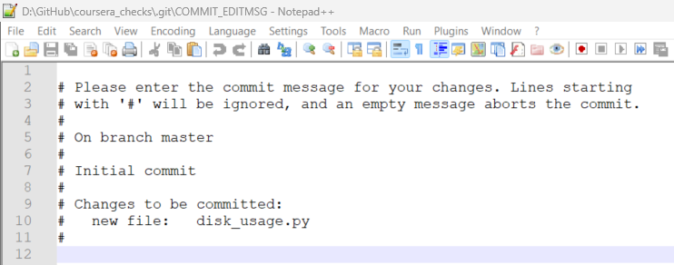

# Notes: Week 1 - Introduction to Version Control

- [Notes: Week 1 - Introduction to Version Control](#notes-week-1---introduction-to-version-control)
  - [Before version control](#before-version-control)
  - [Version Control Systems](#version-control-systems)
  - [Using Git](#using-git)
    - [First step with Git](#first-step-with-git)
    - [Tracking files](#tracking-files)
    - [The Basic Git Workflow](#the-basic-git-workflow)
    - [Anatomy](#anatomy)


## Before version control
We used to make manual copies of older versions as backups, which is a primitive form of VCS

**Diffing files**

`diff`
- We can use `diff <file1> <file2>` command to find the differences between the two files. It will only show the lines that are changed. By highlighting what’s changed, it helps us understand the changes and see how the files have been modified.
- `<` or `-` sign indicates that the line is removed, whereas `>` or `+` indicates that the line is added => The old line got replaced with new line.
- If there are multiple changes, it will be shown as `<line_no_in_file1><change_type><line_no_in_file2>`
  - `5c5` means line 5 in file 1 is changed by line 5 in file 2
  - `11a13` means line 11 to 13 are added in file 2

- We can use `-u` flag to tell the `diff` to show the differences in another format to show additional context (lines)
  - Format:  `diff -u <file1> <file2>` 

- Besides `diff`, there are bunch of graphical tools that display differences side by side in color (e.g., `meld`, `KDiff3`, `vimdiff`)

*Example*
```
$ cat menu1.txt
Menu1:

Apples
Bananas
Oranges
Pears

$ cat menu2.txt
Menu:

Apples
Bananas
Grapes
Strawberries

$ diff -u menu1.txt menu2.txt
--- menu1.txt   2023-02-04 12:37:34.786644200 +0800
+++ menu2.txt   2023-02-04 12:37:53.961690700 +0800
@@ -1,6 +1,6 @@
-Menu1:
+Menu:

 Apples
 Bananas
-Oranges
-Pears
\ No newline at end of file
+Grapes
+Strawberries
\ No newline at end of file


```

**Applying Changes**
- Using `diff -u old_file new_file > change.diff`, we can generate a file called `change.diff` which contains the changes between old and new one, plus additional context needed to understand the changes. This file is called as *diff* file or *patch* file.
- `patch` takes a file generated by `diff` and applies to the changes to the  original file.
  - e.g., `patch cpu_usage.py < change.diff`

While `diff` is the command that generates the difference between two files, `patch` is the command that applies those differences to the original file.

```
# Make a copy of the org version
$ cp .\hello_world_org.txt .\hello_world.txt

# Org version
$ cat hello_world.txt
Hello World

# Long version
$ cat hello_world_long.txt
Hello World

It's a wonderful day!

# Store the diff between org and long version
$ diff -u hello_world.txt hello_world_long.txt > hello_world.diff

$ cat hello_world.diff
--- hello_world.txt     2023-02-04 12:44:02.624060100 +0800
+++ hello_world_long.txt        2023-02-04 12:44:24.827654100 +0800
@@ -1 +1,3 @@
-Hello World
\ No newline at end of file
+Hello World
+
+It's a wonderful day!
\ No newline at end of file

# Patch the difference to the original version
$ patch hello_world.txt < hello_world.diff
patching file hello_world.txt

$ cat hello_world.txt
Hello World

It's a wonderful day!

```

## Version Control Systems
VCS - Lets us keep track of changes made to files. By keeping track of the changes that we make to our files, a VCS lets us know when a file changed, who changed it, why the file was changed, and also lets us easily roll back those changes. VCS can be invaluable even in one-person IT team.

**Commit** - We can make edits to multiple files and treat that collection of edits as a single change

**Repositories** - Group of related files that.

**Git**
- VCS created by Linus Torvald in 2007
- Git has a distributed architecture => Every person contributing to a repository has a full copy of the repo on their own local development machine => They can interact with the tracked files without needing a coordinating server, which in turn improves collaboration.
- Git can work as a standalone program as a server, and as a client
  - We can even use git on a single machine even without a network connection. 
  - Or we can use it as a server on a machine, where we want to host our repo. Then, we can use git to act as a client to access the repo from another machine or even the same one.
- Git clients can communicate to the git servers over the network using HTTP, SSH, or Git's own specific protocol.
- We can use it to track private work that we can keep to ourselves or we can share our work with others by hosting a code on public servers like *Github*, *Gitlab* or others. 
- There are other VCS programs like *Subversion* or *Mercurial* that acts as an alternative to Git.

**Gits official website**: [git-scm.com](https://git-scm.com/), where SCM stands for Source Contorl Management, similar to VCS which is more widely adopted acronym.

**More Information About Git**
- https://git-scm.com/doc
- https://www.mercurial-scm.org/
- https://subversion.apache.org/
- https://en.wikipedia.org/wiki/Version_control

**Installing Git**
- Windows
  - We can install it from https://git-scm.com/download/win or https://gitforwindows. org/. additional instructions, refer to [Getting Started - Installing Git](https://git-scm.com/book/en/v2/Getting-Started-Installing-Git)
  - The software package we get includes bunch of other handly tools, such as 
    - Bash emulation environment where we can run all the git commands
    - Unix like utilities
    - GUI to interact with it
  - For Windows, it comes preloaded with environment called MinGW64. This environment lets us operate on Windows with the same commands and tools available on Linux
  - We can open a file in default text editor with git using `start <filename>` 

## Using Git 
### First step with Git
For VCS to track who made the changes, first, we need to tell git who we are using `git config` with values of `user.email` and `user.name`. Using `--global` flag will set this value for all the git repos that we'd use.
```
git config --global user.email "me@example.com"
git config --global user.name "My name"
```

Next step is to start working with git repo in one of 2 ways
1. `git init` - To create a new empty repo in current dir
2. `git clone` - To make a copy of the repo that already exists somewhere else (e.g., online repo in Github)  


```
# Make a new dir
$ mkdir coursera_checks
$ cd coursera_checks 

# Initialise new repo
$ git init 
Initialized empty Git repository in D:/GitHub/coursera_checks/.git/

# Let's check whether '.git/' dir exists!
$ ls -la
total 8
drwxr-xr-x 1 Prasanth 197121 0 Feb  4 17:48 ./
drwxr-xr-x 1 Prasanth 197121 0 Feb  4 17:47 ../
drwxr-xr-x 1 Prasanth 197121 0 Feb  4 17:48 .git/

# Let's look inside '.git/' dir
$ ls -l .git/
total 7
-rw-r--r-- 1 Prasanth 197121  23 Feb  4 17:48 HEAD
-rw-r--r-- 1 Prasanth 197121 130 Feb  4 17:48 config
-rw-r--r-- 1 Prasanth 197121  73 Feb  4 17:48 description
drwxr-xr-x 1 Prasanth 197121   0 Feb  4 17:48 hooks/
drwxr-xr-x 1 Prasanth 197121   0 Feb  4 17:48 info/
drwxr-xr-x 1 Prasanth 197121   0 Feb  4 17:48 objects/
drwxr-xr-x 1 Prasanth 197121   0 Feb  4 17:48 refs/
```
**The `.git` directory** is like a database for our git project that stores all the changes and change history. We won't modify these files directly, rather we interact with them using git commands. Whenever we run `init`, a new `.git` dir is created. Whereas, whenever we `clone` a repo, this `.git` dir is copied locally to our computer. 

**The working tree** area is the area outside the `.git` dir. The working tree is the current version of our project (like a *sandbox*). This working tree contains all the files that are currently tracked by git and any new files that we haven't yet added to the list of track files. 

> The `.git` directory acts as a database for all the changes tracked in Git and the working tree acts as a sandbox where we can edit the current versions of the files.

Let's add a dummy file to our otherwise empty working tree in repo: `coursera_details/`.
```
$ls
disk_usage.py

$ git status
On branch master
Untracked files:
  (use "git add <file>..." to include in what will be committed)
        disk_usage.py

nothing added to commit but untracked files present (use "git add" to track)

```
The above file is currently untracked by git. To make git track our file, we will add it to project using `git add ...` command
```
#  Let's add the 'disk_usage.py' to git tracking (i.e., staging area)
$ git add disk_usage.py 
```

> Staging Area (aka index)
>
> A file maintained by Git that contains all of the info about what files and changes are going to go into our next commit.

Let's get some info about current working tree and pending changes using `git status`
```
$ git status
On branch master

No commits yet

Changes to be committed:
  (use "git rm --cached <file>..." to unstage)
        new file:   disk_usage.py
```

From `git status` output, we can see that the `disk_usage.py` is a new file and the changes are to be commited. => *Changes are currently in staging area*.  

**Our first commit**

To get it commited into the git dir, we need to run `git commit`.
When we run this command, we tell git that we want to save the changes. It opens a text editor (refer image below) where we can enter a commit message. 


Let's add a simple commit message: "Add new disk_usage.py file" and close the editor
```
$ git commit
[master (root-commit) 8b5b272] Add new disk_usage.py file
 1 file changed, 1 insertion(+)
 create mode 100644 disk_usage.py
```

### Tracking files<a name="Tracking_files"></a>
Any Git project will consist of three sections.
1. *`.git` dir*: Contains the history of all the files and changes
2. *Working tree*: Contains the current state of the project, including the changes we made
3. *Staging area*: Contains the changes that are marked to be included in the next commit

**Tracked vs. Untracked files**:
When we operate with Git, our files can be either tracked or untracked. Tracked files are part of the snapshots, while untracked files aren't a part of snapshots yet. This is the usual case for new files. 

**3 states of a tracked file**: Each track file can be in one of three main states, *modified*, *staged* or *committed*. Let's look at what each of these mean.
1. If a file is in the modified state, it means that we've made changes to it that we haven't committed yet. The changes could be adding, modifying or deleting the contents of the file. Git notices anytime we modify our files. But won't store any changes until we add them to the staging area.
2. So, the next step is to stage those changes. When we do this, our modified files become stage files. In other words, the changes to those files are ready to be committed to the project. All files that are staged will be part of the next snapshot we take. 
3. And finally, when a file gets committed, the changes made to it are safely stored in a snapshot in the Git directory. 
   
> This means that typically a file tracked by Git, will first be *modified* when we change it in any way. Then it becomes *staged* when we mark those changes for tracking. And finally it will get *committed* when we store those changes in the VCS.

For e.g., let's say we have a project (code + associate files + series of snapshots) in git. Each time when we commit, git records a new snapshot of the state of our project (or picture of how all the files looked) at that moment in time. Combined, these snapshots make up the history of our project, and it's information gets stored in the `.git` dir. 

After making changes to `disk_usage.py`, if we call `git status`, git tells us that the .py file is modified and  changes are not staged for commit on top of showing some helpful commands
```
$ git status
On branch master
Changes not staged for commit:
  (use "git add <file>..." to update what will be committed)
  (use "git restore <file>..." to discard changes in working directory)
        modified:   disk_usage.py

no changes added to commit (use "git add" and/or "git commit -a")
```

By calling `git add <file>`, we tell git that we want to add the current changes in that `<file>` to list of changes to be commited. This means our file is currently part of staging area and will be committed once we run the next git command, `git commit`.
```
$ git add disk_usage.py

$ git status
On branch master
Changes to be committed:
  (use "git restore --staged <file>..." to unstage)
        modified:   disk_usage.py
```

Instead of opening up the editor while commiting, we can pass the commit message using `-m` flag as follows:
```
$  git commit -m 'Added periods at the end of print statements.'
[master 7dc5534] Added periods at the end of print statements.
 1 file changed, 21 insertions(+), 1 deletion(-)
```
So, now we have commited our stage changes => This creates a new snapshot in Git dir. 

```
$ git status
On branch master
nothing to commit, working tree clean
```
Now, we can see that there are no changes to commit or even stage.

> So to sum up, we work on modified files in our **working tree**. When they're ready, we staged these files by adding them to the **staging area**. Finally, we commit the changes sitting in our staging area, which takes a snapshot of those files and stores them in the database that lives in the **Git directory**. 

### The Basic Git Workflow
Skipped as the example show is similar to [Tracking files](#Tracking_files)

4 git commands are repeatedly used
`init`, `add`, `status`, `commit`

### Anatomy
**What makes a good *commit* message?**
Use the following template
```
Line 1 (<= 50 characters): Short summary of the commit 

Line 3 onwards (<= 72 characters per line): Full description of the changes which details why they are necessary and anything interesting about them or difficult to understand 
```

For more details, visit
- https://commit.style/
- https://thoughtbot.com/blog/5-useful-tips-for-a-better-commit-message

> **Commit Message:** A short description of the change (up to 50 characters), followed by one or more paragraphs giving more details of the change (if needed).

To see the commit logs, we can use `git log`
```
git log
commit 7dc5534c427eb36a9d1b2857b32c4be44db0d4af (HEAD -> master)
Author: prasanth-ntu <prasanththegalaxian@gmail.com>
Date:   Sun Feb 5 06:54:48 2023 +0800

    Added periods at the end of print statements.

commit 8b5b272f7edeb99cd60cb505b81dc038543aeb32
Author: prasanth-ntu <prasanththegalaxian@gmail.com>
Date:   Sat Feb 4 18:08:36 2023 +0800

    Add new disk_usage.py file
```
**Breakdown of the commit log**
- `commit 7dc5534c427eb36a9d1b2857b32c4be44db0d4af` is the commit identifier
- `(HEAD -> master)` tells us that `HEAD` indicator is pointing to the `master` branch
- `Author: prasanth-ntu <prasanththegalaxian@gmail.com>` - Name and email of the user who made the commit
- `Date:   Sun Feb 5 06:54:48 2023 +0800` - Date and time the commit was made
- `    Added periods at the end of print statements.` - The commit message

