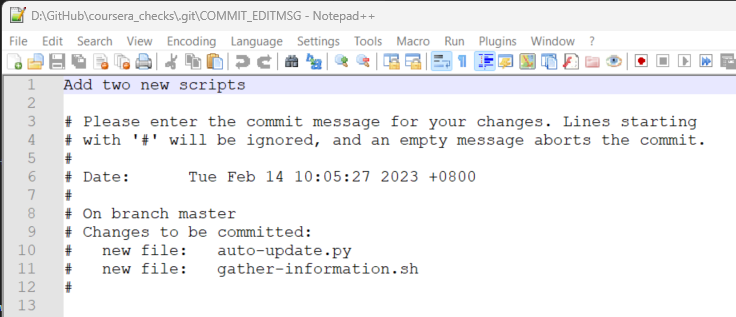
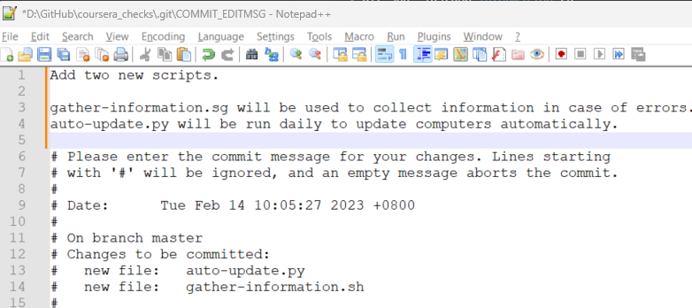
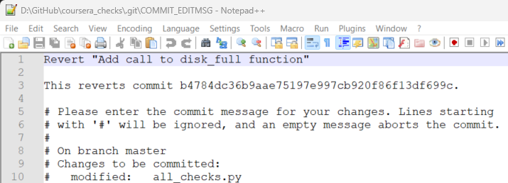
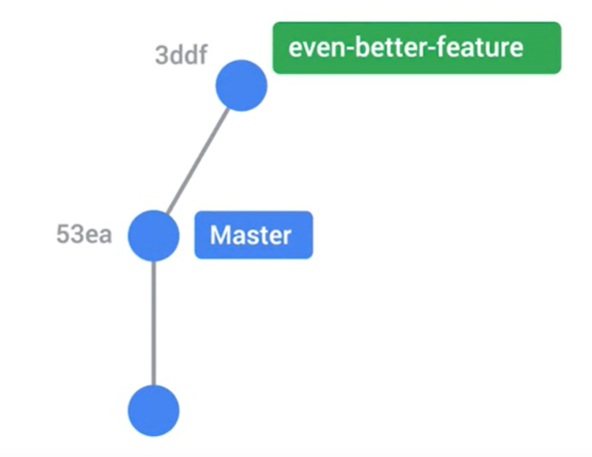
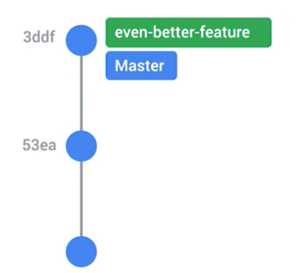
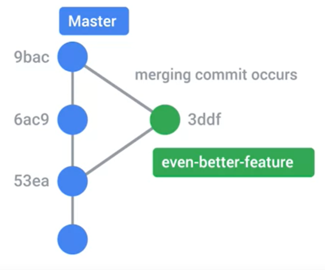

# Notes: Week 2 - Using Git Locally

- [Notes: Week 2 - Using Git Locally](#notes-week-2---using-git-locally)
  - [Advanced Git Interaction](#advanced-git-interaction)
    - [Skipping the Staging Area](#skipping-the-staging-area)
    - [Getting more information about our changes](#getting-more-information-about-our-changes)
    - [Deleting and Renaming Files](#deleting-and-renaming-files)
    - [Advanced Git Cheat Sheet](#advanced-git-cheat-sheet)
  - [Undoing Things](#undoing-things)
    - [Undoing Changes Before Committing](#undoing-changes-before-committing)
    - [Amending Commits](#amending-commits)
    - [Rollbacks](#rollbacks)
    - [Identifying a Commit](#identifying-a-commit)
    - [Git Revert Cheat Sheet](#git-revert-cheat-sheet)
  - [Branching and Merging](#branching-and-merging)
    - [What is a branch?](#what-is-a-branch)
    - [Creating New Branches](#creating-new-branches)
    - [Working with Branches](#working-with-branches)
    - [Merging](#merging)
    - [Merge Conflicts](#merge-conflicts)
    - [Git Branches and Merging Cheat Sheet](#git-branches-and-merging-cheat-sheet)

## Advanced Git Interaction
### Skipping the Staging Area
Basic git workflow
- Make changes
- Stage them 
- Commit them

> The separate steps between staging and commiting allows us to stage several changes into one commit.

However, if we are sure that the current small changes are what we want to commit, we can skip staging and go directly to commit using `-a` flag to `git commit` command. This **`-a` flag automatically stages all files that is tracked and modified** before doing this commit, thereby allowing us to skip `git add` step. 

> `git commit -a` is not same as `git add` > `git commit`. Remember, `git commit -a` does not work on new files as they are not tracked. **It's just a shortcut to stage any changes to tracked files and commit them in one step**.
If the modified files has never been committed to the repo, we still need to use `git add` to track it first.

**Example**

Let's modify the `all_checks.py` file, which is already being tracked by git.
```ps
$ git status
On branch master
Changes not staged for commit:
  (use "git add <file>..." to update what will be committed)
  (use "git restore <file>..." to discard changes in working directory)
        modified:   all_checks.py

no changes added to commit (use "git add" and/or "git commit -a")
```
So, now we can stage and commit in one step
```ps
$ git commit -a -m "Call check_reboot fn from main fn, exit with 1 on error"
[master cbc7dba] Call check_reboot fn from main fn, exit with 1 on error
 1 file changed, 4 insertions(+), 1 deletion(-)
```

Let's check the commit logs. 
```ps
$ git log
commit cbc7dba8833ec43f51700aeaa2e2822b761ec105 (HEAD -> master)
Author: prasanth-ntu <prasanththegalaxian@gmail.com>
Date:   Sun Feb 5 10:16:24 2023 +0800

    Call check_reboot fn from main fn, exit with 1 on error

commit 05343e7ca05fbaf4209c6ca7d9215bf23a630886
Author: prasanth-ntu <prasanththegalaxian@gmail.com>
Date:   Sun Feb 5 10:06:00 2023 +0800

    Add all checks py file that checks whether reboot required

commit 7dc5534c427eb36a9d1b2857b32c4be44db0d4af
Author: prasanth-ntu <prasanththegalaxian@gmail.com>
Date:   Sun Feb 5 06:54:48 2023 +0800

    Added periods at the end of print statements.

commit 8b5b272f7edeb99cd60cb505b81dc038543aeb32
Author: prasanth-ntu <prasanththegalaxian@gmail.com>
Date:   Sat Feb 4 18:08:36 2023 +0800

    Add new disk_usage.py file
```
We can see that the `HEAD` indicator has moved to our latest commit (currently checked-out snapshot).

**`Head`**
> Git uses `HEAD` alias to represent the currently checked-out snapshot of our project. In simple terms, think of `HEAD` as pointer to our current branch. 

When we use branches, `HEAD`  can be a commit in a different branch of the project. We can even use git to go back in time and have `HEAD`  representing old commit from before the last changes were applied. In all cases, `HEAD` indicates what the currently checked out snapshot is. This is how git marks our place in the project. Think of it as bookmark that we can use to keep track of where we are. Even if we have multiple books to read, the bookmark allows us to pick up right where we left off.

### Getting more information about our changes
We know `git log` shows us the list of commits made in the current Git repo along with commit message, author, and date of change.
```ps
$ git log
commit cbc7dba8833ec43f51700aeaa2e2822b761ec105 (HEAD -> master)
Author: prasanth-ntu <prasanththegalaxian@gmail.com>
Date:   Sun Feb 5 10:16:24 2023 +0800

    Call check_reboot fn from main fn, exit with 1 on error

commit 05343e7ca05fbaf4209c6ca7d9215bf23a630886
Author: prasanth-ntu <prasanththegalaxian@gmail.com>
Date:   Sun Feb 5 10:06:00 2023 +0800

    Add all checks py file that checks whether reboot required

commit 7dc5534c427eb36a9d1b2857b32c4be44db0d4af
Author: prasanth-ntu <prasanththegalaxian@gmail.com>
Date:   Sun Feb 5 06:54:48 2023 +0800

    Added periods at the end of print statements.

commit 8b5b272f7edeb99cd60cb505b81dc038543aeb32
Author: prasanth-ntu <prasanththegalaxian@gmail.com>
Date:   Sat Feb 4 18:08:36 2023 +0800

    Add new disk_usage.py file
```

If we also need to look at the actual lines changed in each commit, we can use the `-p` flag with `git log`. The p comes from patch which is equivalent to `diff -u` we learnt earlier in [week 1](./../week_1/README.md#before-version-control). We can use page up, page down, and the arrow keys to navigate/scroll the output. Using this option, we can quickly see what changes were made to the files in our repository. This can be especially useful if we're trying to track down a change that recently broke our tools.
```ps
$ git log -p
commit cbc7dba8833ec43f51700aeaa2e2822b761ec105 (HEAD -> master)
Author: prasanth-ntu <prasanththegalaxian@gmail.com>
Date:   Sun Feb 5 10:16:24 2023 +0800

    Call check_reboot fn from main fn, exit with 1 on error

diff --git a/all_checks.py b/all_checks.py
index ea7ff5a..f96abe4 100644
--- a/all_checks.py
+++ b/all_checks.py
@@ -1,8 +1,11 @@
 import os
+import sys

 def check_reboot():
     """Returns True if the computer has pending reboot."""
     return os.path.exist("/run/reboot-required")

 def main():
-    check_reboot()
\ No newline at end of file
+    if check_reboot():
+        print ("Pending Reboot")
+        sys.exit(1)
\ No newline at end of file

commit 05343e7ca05fbaf4209c6ca7d9215bf23a630886
Author: prasanth-ntu <prasanththegalaxian@gmail.com>
Date:   Sun Feb 5 10:06:00 2023 +0800

    Add all checks py file that checks whether reboot required

diff --git a/all_checks.py b/all_checks.py
:
```

If we need to look at the actual lines changed in a specific commit, we can use `git show <commit_id>`
```ps
$ git show 05343e7ca05fbaf4209c6ca7d9215bf23a630886
commit 05343e7ca05fbaf4209c6ca7d9215bf23a630886
Author: prasanth-ntu <prasanththegalaxian@gmail.com>
Date:   Sun Feb 5 10:06:00 2023 +0800

    Add all checks py file that checks whether reboot required

diff --git a/all_checks.py b/all_checks.py
new file mode 100644
index 0000000..ea7ff5a
--- /dev/null
+++ b/all_checks.py
@@ -0,0 +1,8 @@
+import os
+
+def check_reboot():
+    """Returns True if the computer has pending reboot."""
+    return os.path.exist("/run/reboot-required")
+
+def main():
+    check_reboot()
\ No newline at end of file
```

Using `git log --stat`, we can see some stats about the changes in the commit, like which files were changed and how many lines were added or removed.
```ps
$ git log --stat
commit cbc7dba8833ec43f51700aeaa2e2822b761ec105 (HEAD -> master)
Author: prasanth-ntu <prasanththegalaxian@gmail.com>
Date:   Sun Feb 5 10:16:24 2023 +0800

    Call check_reboot fn from main fn, exit with 1 on error

 all_checks.py | 5 ++++-
 1 file changed, 4 insertions(+), 1 deletion(-)

commit 05343e7ca05fbaf4209c6ca7d9215bf23a630886
Author: prasanth-ntu <prasanththegalaxian@gmail.com>
Date:   Sun Feb 5 10:06:00 2023 +0800

    Add all checks py file that checks whether reboot required

 all_checks.py | 8 ++++++++
 1 file changed, 8 insertions(+)

commit 7dc5534c427eb36a9d1b2857b32c4be44db0d4af
Author: prasanth-ntu <prasanththegalaxian@gmail.com>
Date:   Sun Feb 5 06:54:48 2023 +0800

    Added periods at the end of print statements.

 disk_usage.py | 22 +++++++++++++++++++++-
 1 file changed, 21 insertions(+), 1 deletion(-)

commit 8b5b272f7edeb99cd60cb505b81dc038543aeb32
Author: prasanth-ntu <prasanththegalaxian@gmail.com>
Date:   Sat Feb 4 18:08:36 2023 +0800

    Add new disk_usage.py file
:
```

Let's make some changes to a script and try out `git diff` command.
```ps
$ git diff all_checks.py
diff --git a/all_checks.py b/all_checks.py
index f96abe4..e33470f 100644
--- a/all_checks.py
+++ b/all_checks.py
@@ -8,4 +8,8 @@ def check_reboot():
 def main():
     if check_reboot():
         print ("Pending Reboot")
-        sys.exit(1)
\ No newline at end of file
+        sys.exit(1)
+    print ("Everything ok.")
+    sys.exit(0)
+
+main()
\ No newline at end of file
```

Alternatively, to review the changes before adding them to staging is to use `-p` flag with the `git add` command
```ps
$ git add -p
diff --git a/all_checks.py b/all_checks.py
index f96abe4..e33470f 100644
--- a/all_checks.py
+++ b/all_checks.py
@@ -8,4 +8,8 @@ def check_reboot():
 def main():
     if check_reboot():
         print ("Pending Reboot")
-        sys.exit(1)
\ No newline at end of file
+        sys.exit(1)
+    print ("Everything ok.")
+    sys.exit(0)
+
+main()
\ No newline at end of file
(1/1) Stage this hunk [y,n,q,a,d,e,?]? y
```

If we call `git diff`, it will not show us any changes because, it will only show unstaged changes by default.
```ps
$ git diff
```

So, we can use `git diff --staged` to show the changes that are staged, but not commited. So, we can see the actual staged changes before we call `git commit` 
```ps
$ git diff --staged
diff --git a/all_checks.py b/all_checks.py
index f96abe4..e33470f 100644
--- a/all_checks.py
+++ b/all_checks.py
@@ -8,4 +8,8 @@ def check_reboot():
 def main():
     if check_reboot():
         print ("Pending Reboot")
-        sys.exit(1)
\ No newline at end of file
+        sys.exit(1)
+    print ("Everything ok.")
+    sys.exit(0)
+
+main()
\ No newline at end of file
```

Now, let's commit the staged changes.
```ps
$ git commit -m "Add a message when everything is ok"
[master 45af652] Add a message when everything is ok
 1 file changed, 6 insertions(+), 2 deletions(-)
```

### Deleting and Renaming Files
To remove/delete a file, we can use `git rm` command
```ps
$ ls -l
total 4
-rw-r--r-- 1 Prasanth 197121 306 Feb  5 10:59 all_checks.py
-rw-r--r-- 1 Prasanth 197121 306 Feb  5 10:59 all_checks_del.py
-rw-r--r-- 1 Prasanth 197121 306 Feb  5 10:59 all_checks_rm.py
-rw-r--r-- 1 Prasanth 197121 655 Feb  5 06:47 disk_usage.py

$ git rm all_checks_rm.py
rm 'all_checks_rm.py'

$ git status
On branch master
Changes to be committed:
  (use "git restore --staged <file>..." to unstage)
        deleted:    all_checks_rm.py

$ git commit -m "Delete unneeded all checks file"
[master c20b806] Delete unneeded all checks file
 1 file changed, 15 deletions(-)
 delete mode 100644 all_checks_rm.py

```
After the `rm` command, the delete changes are added to staging.  

To rename an existing file, we can use `git mv` command
```ps
$ ls -l
total 3
-rw-r--r-- 1 Prasanth 197121 306 Feb  5 10:59 all_checks.py
-rw-r--r-- 1 Prasanth 197121 306 Feb  5 10:59 all_checks_del.py
-rw-r--r-- 1 Prasanth 197121 655 Feb  5 06:47 disk_usage.py

$ git mv all_checks_del.py all_checks_new.py

$ git status
On branch master
Changes to be committed:
  (use "git restore --staged <file>..." to unstage)
        renamed:    all_checks_del.py -> all_checks_new.py

$ git commit -m "Rename all_checks_del.py "
[master ee7dbbb] Rename all_checks_del.py
 1 file changed, 0 insertions(+), 0 deletions(-)
 rename all_checks_del.py => all_checks_new.py (100%)
```

To ignore file(s) that are automatically generated by scripts or OS generated artifacts, we need to ignore them so that they won't add noise to the output of git status. To do this, we can use `.gitignore` file. Inside this file, we can specify rules to tell git to which files to skip for the current repo.
```ps
$ ls -a -l
total 12
drwxr-xr-x 1 Prasanth 197121   0 Feb  5 11:18 ./
drwxr-xr-x 1 Prasanth 197121   0 Feb  4 17:47 ../
-rw-r--r-- 1 Prasanth 197121 102 Feb  5 11:18 .file_to_be_ignored
drwxr-xr-x 1 Prasanth 197121   0 Feb  5 11:19 .git/
-rw-r--r-- 1 Prasanth 197121 306 Feb  5 10:59 all_checks.py
-rw-r--r-- 1 Prasanth 197121 306 Feb  5 10:59 all_checks_new.py
-rw-r--r-- 1 Prasanth 197121 655 Feb  5 06:47 disk_usage.py
```
Let's create a `.gitignore` file containing the name of the file to be hidden `.file_to_be_ignored`. Then, add it to staging and then commit the staged changes.
```ps
$ echo .file_to_be_ignored > .gitignore

$ ls -l -a
total 17
drwxr-xr-x 1 Prasanth 197121   0 Feb  5 11:23 ./
drwxr-xr-x 1 Prasanth 197121   0 Feb  4 17:47 ../
-rw-r--r-- 1 Prasanth 197121 102 Feb  5 11:18 .file_to_be_ignored
drwxr-xr-x 1 Prasanth 197121   0 Feb  5 11:19 .git/
-rw-r--r-- 1 Prasanth 197121  20 Feb  5 11:23 .gitignore
-rw-r--r-- 1 Prasanth 197121 306 Feb  5 10:59 all_checks.py
-rw-r--r-- 1 Prasanth 197121 306 Feb  5 10:59 all_checks_new.py
-rw-r--r-- 1 Prasanth 197121 655 Feb  5 06:47 disk_usage.py

$ git add .gitignore

$ $ git commit -m "Add a gitignore file, ignoring .file_to_be_ignored"
[master f1e5e4a] Add a gitignore file, ignoring .file_to_be_ignored
 1 file changed, 1 insertion(+)
 create mode 100644 .gitignore
```

### Advanced Git Cheat Sheet
[Git Cheat Sheet](https://training.github.com/downloads/github-git-cheat-sheet.pdf)

| Command   | Explanation & Link |
| --------- | ------------------------- |
| `git commit -a` | [Stages files automatically](https://git-scm.com/docs/git-commit#Documentation/git-commit.txt---all) |
| `git log -p` | [Produces patch text](https://git-scm.com/docs/git-log#_generating_patch_text_with_p) | 
| `git log --stat` | Stats about the changes in the commit, like which files were changed and how many lines were added or removed. |
| `git show` | [Shows various objects](https://git-scm.com/docs/git-show) |
| `git diff` | [Is similar to the Linux `diff` command, and can show the differences in various commits](https://git-scm.com/docs/git-diff) |
| `git diff --staged` | [An alias to --cached, this will show all staged files compared to the named commit](https://git-scm.com/docs/git-diff) | 
| `git add -p` | [Allows a user to interactively review patches to add to the current commit](https://git-scm.com/docs/git-add) |
| `git mv` | [Similar to the Linux `mv` command, this moves a file](https://git-scm.com/docs/git-mv) |
| `git rm` | [Similar to the Linux `rm` command, this deletes, or removes a file](https://git-scm.com/docs/git-rm) |

`.gitignore` files -  to tell the git tool to intentionally ignore some files in a given Git repository. For example, this can be useful for configuration files or metadata files that a user may not want to check into the master branch. Check out more at: https://git-scm.com/docs/gitignore.

A few common examples of file patterns to exclude can be found [here](https://gist.github.com/octocat/9257657).

---

## Undoing Things
### Undoing Changes Before Committing
`git checkout` to revert changes to the modified files before they get staged. This can restore the file to the latest storage snapshot, which can either be committed or staged.

```ps
$ cat all_checks.py
import os
import sys

def check_reboot():
    """Returns True if the computer has pending reboot."""
    return os.path.exists("/run/reboot-required")

def main():
    if check_reboot():
        print ("Pending Reboot")
        sys.exit(1)
    print ("Everything ok.")
    sys.exit(0)

main()
```
Let's delete the `check_reboot` function in the above script that would break it if we run the script.
```ps
$ cat all_checks.py
import os
import sys


def main():
    if check_reboot():
        print ("Pending Reboot")
        sys.exit(1)
    print ("Everything ok.")
    sys.exit(0)

main()

$ python all_checks.py
Traceback (most recent call last):
  File "all_checks.py", line 12, in <module>
    main()
  File "all_checks.py", line 6, in main
    if check_reboot():
NameError: name 'check_reboot' is not defined

$ git status
On branch master
Changes not staged for commit:
  (use "git add <file>..." to update what will be committed)
  (use "git restore <file>..." to discard changes in working directory)
        modified:   all_checks.py

no changes added to commit (use "git add" and/or "git commit -a")
```
We can run `git add` to stage our changes or `git restore` to discard them before the changes get staged.
```ps
$ git restore all_checks.py

$ git status
On branch master
nothing to commit, working tree clean
```

How to undo staged changes that we do not want to commit (which happens all the time), especially if we use `git add *` which stages all the changes for commit?
We can unstage the changes using `git reset` 

Let's assume we are debugging a problem in our `all_checks.py` script. Also, modified the comment in code to include it in changes to be commited and stagged for experimenting with unstaging.
```ps
$ git diff
diff --git a/all_checks.py b/all_checks.py
index 248a84a..aacb17c 100644
--- a/all_checks.py
+++ b/all_checks.py
@@ -2,7 +2,7 @@ import os
 import sys

 def check_reboot():
-    """Returns True if the computer has pending reboot."""
+    """Returns True if the computer has pending reboot!"""
     return os.path.exists("/run/reboot-required")

 def main():

$ python .\all_checks.py > output.txt

$ cat .\output.txt
Everything ok.

$ git status
On branch master
Changes not staged for commit:
  (use "git add <file>..." to update what will be committed)
  (use "git restore <file>..." to discard changes in working directory)
        modified:   all_checks.py

Untracked files:
  (use "git add <file>..." to include in what will be committed)
        output.txt

no changes added to commit (use "git add" and/or "git commit -a")

# One modified file (tracked), one new file (untracked)
$ git add *
$ git status
On branch master
Changes to be committed:
  (use "git restore --staged <file>..." to unstage)
        modified:   all_checks.py
        new file:   output.txt
```
The `output.txt` file which was supposed to be a temporary file for debugging in now included in the staging area. So, we need to unstage it.

```ps
# By running this command, we reset our changes to whatever is in the current snapshot.
$ git reset HEAD .\output.txt
# or alternatively,
$ git restore --staged .\output.txt

$ git status
On branch master
Changes to be committed:
  (use "git restore --staged <file>..." to unstage)
        modified:   all_checks.py

Untracked files:
  (use "git add <file>..." to include in what will be committed)
        output.txt
```
> We can think of `git restore` or `git reset` as counterpart to `git add`. We can use `git reset -p` to get git to ask you which specific changes you want to reset for the file.

### Amending Commits
`git commit --amend` allows us to modify and add changes to the most recent commit. 

Let's create two new files using `touch` command, and do a wrong commit by forgetting one of the file.
```ps
$ touch auto-update.py
$ touch gather-information.sh
$ git status
On branch master
Untracked files:
  (use "git add <file>..." to include in what will be committed)
        auto-update.py
        gather-information.sh

nothing added to commit but untracked files present (use "git add" to track)

$ git add .\auto-update.py
$  git commit -m "Add two new scripts"
[master 9de90f6] Add two new scripts
 1 file changed, 0 insertions(+), 0 deletions(-)
 create mode 100644 auto-update.py
```
From the commit message, we can see that only one file is added. However, our commit message says that we have added 2 files => We forgot to include the second file. Let's fix it.
```ps
# Add the missing file
$ git add .\gather-information.sh

# Lets amend our commit
$ git commit --amend
```
Editer opens up showing the commit message and stats. We can see that both files are added for this commit. 


Let's add additional description before commiting as follows.


```ps
$ git commit --amend
[master b5531fc] Add two new scripts.
 Date: Tue Feb 14 10:05:27 2023 +0800
 2 files changed, 0 insertions(+), 0 deletions(-)
 create mode 100644 auto-update.py
 create mode 100644 gather-information.sh

 $ git log
commit b5531fcce89165893d4f811719f0df975d963525 (HEAD -> master)
Author: prasanth-ntu <prasanththegalaxian@gmail.com>
Date:   Tue Feb 14 10:05:27 2023 +0800

    Add two new scripts.

    gather-information.sg will be used to collect information in case of errors.
    auto-update.py will be run daily to update computers automatically.
...
```
We could also just update the message of the previous commit by running the `git commit --amend` command with no changes in the staging area.

> Fixing up local commit with `--amend` is great. We should push it to shared repository only after we fixed it. **We should avoid amending commits that have already been made public.**

### Rollbacks
How to fix a bad commit that's been snapshoted by git, especially when we find critical problems with recent changes/commit? Time for a rollback.

There are few ways to rollback commits in Git. `git revert` is one such command. It doesn't mean undo. Instead, it creates a new commit that contains the inverse of all the changes made in the bad commit in order to cancel them out. This way, we get the effect of having undone the changes, but history of the commits in the project remains conssitent leaving a record of exactly what happened.

>  With `git revert`, a new commit is created with inverse changes. This cancels previous changes instead of making it as though the original commit never happened

Let's add a faulty commit (by calling a function without defining it in `all_checks.py`) to our repo.
```ps
$ git diff
diff --git a/all_checks.py b/all_checks.py
index 248a84a..84119d0 100644
--- a/all_checks.py
+++ b/all_checks.py
@@ -9,6 +9,9 @@ def main():
     if check_reboot():
         print ("Pending Reboot")
         sys.exit(1)
+    if disk_full():
+        print ("Disk Full.")
+        sys.exit(1)
     print ("Everything ok.")
     sys.exit(0)

$ git commit -a -m "Add call to disk_full function"
[master b4784dc] Add call to disk_full function
 1 file changed, 3 insertions(+)
```
Now, we realise that something is wrong with our script that we committed and, we need to rollback so that we can get rid of faulty code using `git revert HEAD`.
```ps
$ python .\all_checks.py
Traceback (most recent call last):
  File ".\all_checks.py", line 18, in <module>
    main()
  File ".\all_checks.py", line 12, in main
    if disk_full():
NameError: name 'disk_full' is not defined

$ git revert HEAD
```
We can see that git has automatically added the previous commit id, indicating it is a rollback. 


Let's add some details on why we are reverting this commit.
```ps
 git revert HEAD
[master 3b40010] Revert "Add call to disk_full function"
 1 file changed, 3 deletions(-)
```
The output from `git revert` command looks similar to the output of `git commit` command as git revert creates a commit for us. Since, revert is a normal commit, we can see both the commit and reverted commit in the logs.
```ps
# To see only the last 2 commits 
$ git log -2
commit 3b40010189b5175c3b61e1e1ea450060409cbd00 (HEAD -> master)
Author: prasanth-ntu <prasanththegalaxian@gmail.com>
Date:   Tue Feb 14 10:38:50 2023 +0800

    Revert "Add call to disk_full function"

    Reason for rollback: the disk_full function is not defined.

    This reverts commit b4784dc36b9aae75197e997cb920f86f13df699c.

commit b4784dc36b9aae75197e997cb920f86f13df699c
Author: prasanth-ntu <prasanththegalaxian@gmail.com>
Date:   Tue Feb 14 10:37:11 2023 +0800

    Add call to disk_full function
```

```ps
To see only the last 2 commits with the patch created by the commit
$ git log -p -2
commit 3b40010189b5175c3b61e1e1ea450060409cbd00 (HEAD -> master)
Author: prasanth-ntu <prasanththegalaxian@gmail.com>
Date:   Tue Feb 14 10:38:50 2023 +0800

    Revert "Add call to disk_full function"

    Reason for rollback: the disk_full function is not defined.

    This reverts commit b4784dc36b9aae75197e997cb920f86f13df699c.

diff --git a/all_checks.py b/all_checks.py
index 84119d0..248a84a 100644
--- a/all_checks.py
+++ b/all_checks.py
@@ -9,9 +9,6 @@ def main():
     if check_reboot():
         print ("Pending Reboot")
         sys.exit(1)
-    if disk_full():
-        print ("Disk Full.")
-        sys.exit(1)
     print ("Everything ok.")
     sys.exit(0)


commit b4784dc36b9aae75197e997cb920f86f13df699c
Author: prasanth-ntu <prasanththegalaxian@gmail.com>
Date:   Tue Feb 14 10:37:11 2023 +0800

    Add call to disk_full function

diff --git a/all_checks.py b/all_checks.py
index 248a84a..84119d0 100644
--- a/all_checks.py
+++ b/all_checks.py
@@ -9,6 +9,9 @@ def main():
     if check_reboot():
         print ("Pending Reboot")
         sys.exit(1)
+    if disk_full():
+        print ("Disk Full.")
+        sys.exit(1)
     print ("Everything ok.")
     sys.exit(0)

(END)
```

### Identifying a Commit
How to revert a commit farther back in time? We can target a specific commit by commit id. 

Commit id - 40 character string is a `hash`, calculated using cryptographic algorithm called `SHA1`. This `SHA1` takes bunch of data as input (incase of git, the inputs are info that makes up the commit such as commit msg, date, author, and snapshot taken of the working tree), and produces this hash (commit id in case of git) as the output. 

Why hash instead of auto-increment integers as commit ids? SHA1 based hash gaurantees the consistency of our repos and data in it. The chances of two commits generating a same hash (a.k.a. collision) is extremely small that it wouldn't happen by chance. If the data is hampered in our repo, git can use the hash to spot the corruption (data we got is not the data we expected). 

Let's do 2 dummy commits by making changes to `all_checks.py` and revert them back.

```ps
$ git commit -a -m "Dummy change 1"
[master 35ca3eb] Dummy change 1
 1 file changed, 3 insertions(+), 1 deletion(-)
$ git commit -a -m "Dummy change 2"
[master 6ae733a] Dummy change 2
 1 file changed, 2 insertions(+), 1 deletion(-) 

$ git log -3
commit 6ae733aeac9287addb68ed44c2717c4552936d30 (HEAD -> master)
Author: prasanth-ntu <prasanththegalaxian@gmail.com>
Date:   Tue Feb 14 10:56:48 2023 +0800

    Dummy change 2

commit 35ca3eb8a7865f3364df86f9597f2d1054b6336f
Author: prasanth-ntu <prasanththegalaxian@gmail.com>
Date:   Tue Feb 14 10:56:37 2023 +0800

    Dummy change 1

commit 3b40010189b5175c3b61e1e1ea450060409cbd00
Author: prasanth-ntu <prasanththegalaxian@gmail.com>
Date:   Tue Feb 14 10:38:50 2023 +0800

    Revert "Add call to disk_full function"

    Reason for rollback: the disk_full function is not defined.

    This reverts commit b4784dc36b9aae75197e997cb920f86f13df699c.
```
We could even show the first few characters of the commit id for git to find the entire commit id automatically.
```ps
# Let's do a git show of the commit id we are intending to revert to 
$ git show 3b40010189b5175c3b61e1e1ea450060409cbd00
# or
$ git show 3b40 
commit 3b40010189b5175c3b61e1e1ea450060409cbd00
Author: prasanth-ntu <prasanththegalaxian@gmail.com>
Date:   Tue Feb 14 10:38:50 2023 +0800

    Revert "Add call to disk_full function"

    Reason for rollback: the disk_full function is not defined.

    This reverts commit b4784dc36b9aae75197e997cb920f86f13df699c.

diff --git a/all_checks.py b/all_checks.py
index 84119d0..248a84a 100644
--- a/all_checks.py
+++ b/all_checks.py
@@ -9,9 +9,6 @@ def main():
     if check_reboot():
         print ("Pending Reboot")
         sys.exit(1)
-    if disk_full():
-        print ("Disk Full.")
-        sys.exit(1)
     print ("Everything ok.")
     sys.exit(0)

$ git revert 3b40
Auto-merging all_checks.py
hint: Waiting for your editor to close the file... 
```
After editing the revert commit message
```ps
$ git revert 3b40
Auto-merging all_checks.py
[master 49480eb] Revert "Revert "Add call to disk_full function""
 1 file changed, 3 insertions(+)
 ```
So, we successfully managed to revert the commit id that was not the most recent ones.

### Git Revert Cheat Sheet

[`git restore`] is used to revert changes to the modified files before they get staged or after they get staged. 

[`git checkout`](https://git-scm.com/docs/git-checkout) is effectively used to switch branches.

[`git reset`](https://git-scm.com/docs/git-reset#_examples) basically resets the repo, throwing away some changes. It’s somewhat difficult to understand, so reading the examples in the documentation may be a bit more useful.

There are some other useful articles online, which discuss more aggressive approaches to [resetting the repo](https://jwiegley.github.io/git-from-the-bottom-up/3-Reset/4-doing-a-hard-reset.html).

[`git commit --amend`](https://git-scm.com/docs/git-commit#Documentation/git-commit.txt---amend) is used to make changes to commits after-the-fact, which can be useful for making notes about a given commit.

[`git revert`](https://git-scm.com/docs/git-revert) makes a new commit which effectively rolls back a previous commit. It’s a bit like an undo command.

There are a [few ways](https://git-scm.com/book/en/v2/Git-Basics-Undoing-Things) you can rollback commits in Git.

There are some interesting considerations about how git object data is stored, such as the usage of sha-1. 
Feel free to read more here:
- https://en.wikipedia.org/wiki/SHA-1
- https://github.blog/2017-03-20-sha-1-collision-detection-on-github-com/

---

## Branching and Merging
### What is a branch?

Branches are an important part of the Git work flow.

In Git, a branch at the most basic level is just a pointer to a particular commit. But more importantly, it represents an independent line of development in a project. Of which the commit it points to is the latest link in a chain of developing history. The default branch that Git creates for you when a new repository initialized is called `master` or `main`. All of our examples and development have taken place on this branch so far. The `master` branch is commonly used to represent the known good state of a project. When you want to develop a feature or try something new in your project, you can create a separate branch to do your work without worrying about messing up this current working state. We can merge the branch back into master branch or we can discard our changes without negative impact to our master branch.

Purpose of organizing repositories into branches?
Enable changes to be worked on without disrupting the most current working state. 
> By creating a new branch, we can experiment without breaking what already works.

### Creating New Branches
> We can use `git branch` command to list, create, delete, and manipulate branches. 

```ps
$ git branch
* master

$ git branch new-feature
$ git branch
* master
  new-feature
```
We are still in master branch. To switch to our new branch, use `git checkout` command. The working tree will be updated to match the selected branch including both the files and git history.
```ps
$ git checkout new-feature
Switched to branch 'new-feature'
$ git branch
  master
* new-feature
```

To create a new branch and checkout immediately in a single command, we can use `git checkout -b <new-branch>` 
```ps
git checkout -b even-better-feature
Switched to a new branch 'even-better-feature'
```
Let's create a `free_memory.py` file inside this branch, populate some basic content (incomplete though) and commit.
```ps
$ code free_memory.py

$ cat .\free_memory.py
def main():
    pass

main()

$ git status              
On branch even-better-feature
Untracked files:
  (use "git add <file>..." to include in what will be committed)
        free_memory.py

nothing added to commit but untracked files present (use "git add" to track)

$ git add .\free_memory.py
$ git commit -m "Add an empty free_memory.py"
[even-better-feature 90691cb] Add an empty free_memory.py
 1 file changed, 4 insertions(+)
 create mode 100644 free_memory.py
```
Let's check the last 2 commits. Next to latest commit id, git shows that this where `HEAD` is pointing to and the branch is `even-better-feature`. On the other hand, next to the previous commit, git shows that both the `master` and the `new-feature` branches are pointing to that snapshot of the project. => `even-better-feature` branch is ahead of the `master` branch.
```ps
$ git log -2
commit 90691cb80a61ea55dddf596c78b18e44e68fa895 (HEAD -> even-better-feature)
Author: prasanth-ntu <prasanththegalaxian@gmail.com>
Date:   Tue Feb 14 12:15:53 2023 +0800

    Add an empty free_memory.py

commit 8d1a171da55b3a499185940e6281eecd33f4a457 (new-feature, master)
Author: prasanth-ntu <prasanththegalaxian@gmail.com>
Date:   Tue Feb 14 11:40:59 2023 +0800

    Revert "Dummy change 1"

    This reverts commit 35ca3eb8a7865f3364df86f9597f2d1054b6336f.
```

### Working with Branches

From the results below, we can see that `free_memory.py` exists only in `even-better-feature` branch.
```ps
$ git status
On branch even-better-feature
nothing to commit, working tree clean

$ ls -l
total 4
-rw-r--r-- 1 Prasanth 197121 308 Feb 14 11:40 all_checks.py
-rw-r--r-- 1 Prasanth 197121 306 Feb  5 10:59 all_checks_new.py
-rw-r--r-- 1 Prasanth 197121   0 Feb 14 10:03 auto-update.py
-rw-r--r-- 1 Prasanth 197121 655 Feb  5 06:47 disk_usage.py
-rw-r--r-- 1 Prasanth 197121  31 Feb 14 12:14 free_memory.py
-rw-r--r-- 1 Prasanth 197121   0 Feb 14 10:03 gather-information.sh

$ git checkout master
Switched to branch 'master'

$ ls -l
total 3
-rw-r--r-- 1 Prasanth 197121 308 Feb 14 11:40 all_checks.py
-rw-r--r-- 1 Prasanth 197121 306 Feb  5 10:59 all_checks_new.py
-rw-r--r-- 1 Prasanth 197121   0 Feb 14 10:03 auto-update.py
-rw-r--r-- 1 Prasanth 197121 655 Feb  5 06:47 disk_usage.py
-rw-r--r-- 1 Prasanth 197121   0 Feb 14 10:03 gather-information.sh
```
When we do `git checkout <branch-name>` to switch to a different branch, git changes where `HEAD` is pointing. After checking out to `master` branch, we can see that the `HEAD` is pointing to `master` now. The commit from `even-better-feature` branch does not show up at all, and the latest snapshot is the second entry we have seen before.
> When we switch branches, git will also change files in our working tree and commit history to whatever snapshot of our project in that branch (head is currently pointing to).
```ps
$ git log -2
commit 8d1a171da55b3a499185940e6281eecd33f4a457 (HEAD -> master, new-feature)
Author: prasanth-ntu <prasanththegalaxian@gmail.com>
Date:   Tue Feb 14 11:40:59 2023 +0800

    Revert "Dummy change 1"

    This reverts commit 35ca3eb8a7865f3364df86f9597f2d1054b6336f.

commit fe9d9b98be12568182f4dea0cd6bca00dfd9191c
Author: prasanth-ntu <prasanththegalaxian@gmail.com>
Date:   Tue Feb 14 11:38:50 2023 +0800

    Revert "Revert "Revert "Add call to disk_full function"""

    During revert, chose wrong commit id

    This reverts commit 49480eb5d0db317b613e7956997c96e14f69833b.
```
When we checkout to a branch and commit on it, the changes will be added to the history of that branch. Since `free_memory.py` was commited on another branch, it does not show up in the history/working directory of the master branch.

> `HEAD` floats around like a free spirit.

How does git checkout switch branches? The HEAD is moved to the relevant commit on the specified branch.

We can delete unwanted branches using `git branch -d <branch-name>`

```ps
$ git branch
  even-better-feature
* master
  new-feature
$ git branch -d new-feature
Deleted branch new-feature (was 8d1a171).
$ git branch
  even-better-feature
* master
```
If there are changes in the branch we want to delete that have not been merged back into the `master` branch, then git will throw an error.
 ```ps
$ git branch -d even-better-feature
error: The branch 'even-better-feature' is not fully merged.
If you are sure you want to delete it, run 'git branch -D even-better-feature'.
```
To delete a branch whose changes are not merged back into master, run `git branch -D <branch-name>`

### Merging
> Merging is a term that Git uses for combining branched data and history together.

### Merge Conflicts
Once a new feature that we develop in a separate branch is in good shape, we merge the separate branch back into `master` branch. We can do it using `git merge` command which take the independent snapshots and history of one Git branch, and tangle them into another.

Let's check that we are in `master` branch. Then, let's merge the `even-better-feature` branch into `master` branch. 

```ps
$ git branch
  even-better-feature
* master

$ git merge even-better-feature
Updating 8d1a171..90691cb
Fast-forward
 free_memory.py | 4 ++++
 1 file changed, 4 insertions(+)
 create mode 100644 free_memory.py

$ git log   
commit 90691cb80a61ea55dddf596c78b18e44e68fa895 (HEAD -> master, even-better-feature)
Author: prasanth-ntu <prasanththegalaxian@gmail.com>
Date:   Tue Feb 14 12:15:53 2023 +0800

    Add an empty free_memory.py

commit 8d1a171da55b3a499185940e6281eecd33f4a457
Author: prasanth-ntu <prasanththegalaxian@gmail.com>
Date:   Tue Feb 14 11:40:59 2023 +0800

    Revert "Dummy change 1"

    This reverts commit 35ca3eb8a7865f3364df86f9597f2d1054b6336f.

commit fe9d9b98be12568182f4dea0cd6bca00dfd9191c
:
```
As we are on the master branch, the `HEAD` now points at `master`. We can see the `even-better-feature` and `master` branches are now both pointing to the same commit. 
P.S. We do not see a new commit as it's a fast-forward merge.

> Git uses two different algorithms to perform a merge: **fast-forward** and **three-way merge**.

The merge we performed earlier is an example of **fast-forward** merge. This kind of merge occues when all the commits in the checked out (currently active) branch are also in the branch that's being merged. We can say that the commit history of both the branches does not diverge. In these cases, all Git has to do is update the pointers of the branches to the same commit, and no actual merging needs to take place.  

Before merging:


After merging using fast-forward:

On the other hand, a **three-way merge** is performed when the history of the merging branches has divered in some way, and there is not a nice linear path to combine them via fast-forwaring. This happens when a commit is made on one branch after the point when both the branches split. This could have happened if we made a commit on the master branch after creating the other branches such as `even-better-feature`. When this occues, Git will tie the branch histories together with a new commit. And merge the snapshots at the two branch tips with the most recent common ancestor, the commit before the divergence. To do this successfully, Git tries to figure out how to combine both snapshots. If the changes were made in different files, or in different parts of the same file, Git will take both changes and put them together in the result. If instead, the changes are made on the same part of the same file, Git won't know how to merge those changes, and the merge attempt will result in a merge conflict. This sounds scary, we will learn to solve those conflicts in next section.     



### Git Branches and Merging Cheat Sheet 

| Command                   | Explanation & Link                     |
|---------------------------|----------------------------------------|
| `git branch`                | [Used to manage branches](https://git-scm.com/docs/git-branch) |
| `git branch <name>`         | [Creates the branch](https://git-scm.com/book/en/v2/Git-Branching-Basic-Branching-and-Merging) |
| `git branch -d <name>`      | [Deletes the branch](https://git-scm.com/docs/git-branch#Documentation/git-branch.txt--D) |
| `git branch -D <name>`      | [Forcibly deletes the branch](https://git-scm.com/docs/git-branch#Documentation/git-branch.txt--D) |
| `git checkout <branch>`     | [Switches to a branch](https://git-scm.com/docs/git-checkout) |
| `git checkout -b <branch>`  | Creates a new branch and [switches to it](https://git-scm.com/docs/git-checkout#Documentation/git-checkout.txt--bltnewbranchgt) |
| `git merge <branch>`        | [Merge joins branches together](https://git-scm.com/docs/git-merge) |
| `git merge --abort`         | If there are merge conflicts (meaning files are incompatible), `--abort` can be used to abort the merge action |
| `git log --graph --oneline` | [This shows a summarized view of the commit history for a repo](https://git-scm.com/book/en/v2/Git-Basics-Viewing-the-Commit-History) |


---