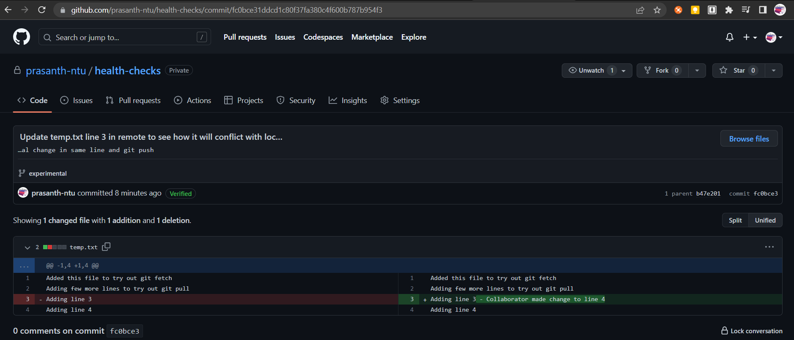

# Notes: Week 3 - Working with Remotes

- [Notes: Week 3 - Working with Remotes](#notes-week-3---working-with-remotes)
  - [Introduction to GitHub](#introduction-to-github)
    - [Intro to Module 3: Working with Remotes](#intro-to-module-3-working-with-remotes)
    - [What is GitHub?](#what-is-github)
    - [Basic Interaction with Github Cheat-Sheet](#basic-interaction-with-github-cheat-sheet)
  - [Basic interaction with GitHub Cheat-Sheet](#basic-interaction-with-github-cheat-sheet-1)
  - [Using a Remote Repository](#using-a-remote-repository)
    - [What is a remote?](#what-is-a-remote)
    - [Working with Remotes](#working-with-remotes)
    - [Fetching New Changes](#fetching-new-changes)
    - [Updating the Local Repository](#updating-the-local-repository)
    - [Git Remotes Cheat-Sheet](#git-remotes-cheat-sheet)
  - [Solving Conflicts](#solving-conflicts)
    - [The Pull-Merge-Push Workflow](#the-pull-merge-push-workflow)
    - [Pushing Remote Branches](#pushing-remote-branches)
    - [Rebasing Your Changes](#rebasing-your-changes)
    - [Another Rebasing Example](#another-rebasing-example)
    - [Best Practices for Collaboration](#best-practices-for-collaboration)
    - [Conflict Resolution Cheat Sheet](#conflict-resolution-cheat-sheet)
- [To clarify/do](#to-clarifydo)

## Introduction to GitHub
### Intro to Module 3: Working with Remotes

### What is GitHub?
**Git** - Distributed Version Control System
> Distributed: Each developer has a copy of the whole repository on their local machine. Each copy is peer (equal) of the others. We can host one of these copies on the remote server and use it as a remote repository for other copies. This lets us synchronise work between copies through the server.

Either we can create/host our own git server, or use one of the off-the-shelf solutions like GitHub, GitLab, BitBucket, etc.  

**GitHub**
- Web-based Git repository hosting service. 
- On top of the version control functionality of Git, GitHub includes extra features like bug tracking, wikis, and task management. 
- GitHub lets us share and access repositories on the web and copy/clone them to our local computer, so we can work on them.
- GitHub provies free access to a Git server for public and private repositories. However, the number of contributors for free private repositories.

> For real configuration and development work, we should use a secure and private Git server, and limit the people authorized to work on it.

### Basic Interaction with Github Cheat-Sheet

- Using the web-based GitHub platform, we can create a fresh/new remote repository. 
  - https://github.com/prasanth-ntu/health-checks
- Then, we need to create a local copy of the repo using `git clone <repo-url>` in the terminal. This command will download the copy of the remote repo to our local machine.
  ```ps
  $ git clone https://github.com/prasanth-ntu/health-checks.git
  Cloning into 'health-checks'...
  remote: Enumerating objects: 3, done.
  remote: Counting objects: 100% (3/3), done.
  remote: Compressing objects: 100% (2/2), done.
  remote: Total 3 (delta 0), reused 0 (delta 0), pack-reused 0
  Receiving objects: 100% (3/3), done.

  $ cd health-checks/

  $ ls -a -l
  total 9
  drwxr-xr-x 1 Prasanth 197121  0 Feb 28 06:53 ./
  drwxr-xr-x 1 Prasanth 197121  0 Feb 28 06:53 ../
  drwxr-xr-x 1 Prasanth 197121  0 Feb 28 06:53 .git/
  -rw-r--r-- 1 Prasanth 197121 65 Feb 28 06:53 README.md
  ```
- Then, `cd` into the repo folder and `ls` to see its contents.
- Let's add some content by opening it with `code README.md`. Add a new line "This repo will be populated with lots of fancy checks."
- Let's stage the change and commit it
  ```ps
  $ git commit -a -m "Add one more line to README.md"
  [main 3d00c9c] Add one more line to README.md
  1 file changed, 2 insertions(+)
  ```
- Let's send our changes made in our local repository to remote repostiory set up on GitHub by using `push` command that will gather all the snapshots we have taken and send them to remote repo.
  - GitHub will ask for username and password. However, in this case, it didn't ask for username and password as we have already setup the credentials globally in the past.
  ```ps
  git push
  Enumerating objects: 5, done.
  Counting objects: 100% (5/5), done.
  Delta compression using up to 8 threads
  Compressing objects: 100% (2/2), done.
  Writing objects: 100% (3/3), 361 bytes | 361.00 KiB/s, done.
  Total 3 (delta 0), reused 0 (delta 0), pack-reused 0
  To https://github.com/prasanth-ntu/health-checks.git
    b5ffeb2..3d00c9c  main -> main
  ```
  
- Few ways we can avoid typing password everytime we run `git push`
  - Use SSH key-pair and store the public key in our profile so that GitHub recognizes our computer.
  - Another option is to use credential helper which caches our credentials for a time window so that we don't need to enter password with every interaction. Git already comes with credential helper, and we just need to enable it using `git config --global credential.helper cache`, and enter credentials one more time, which will then cache our credentials for 15 mins.
- Let's run `git pull` to retrieve new changes from repo.
  ```ps
  $ git pull
  Already up to date.
  ``` 

## Basic interaction with GitHub Cheat-Sheet
There are various remote repository hosting sites:
- GitHub
- BitBucket
- Gitlab

Some useful commands to getting started

| Command | Explanation & Link |
|---------------------------|----------------------------------------|
| `git clone URL` | [Git clone is used to clone a remote repository into a local workspace](https://git-scm.com/docs/git-clone) |
| `git push` | [Git push is used to push commits from your local repo to a remote repo](https://git-scm.com/docs/git-push) |
| `git pull` | [Git pull is used to fetch the newest updates from a remote repository](https://git-scm.com/docs/git-pull) |

This can be useful for keeping your local workspace up to date.
- https://help.github.com/en/articles/caching-your-github-password-in-git
- https://help.github.com/en/articles/generating-an-ssh-key  

---

## Using a Remote Repository
### What is a remote?
- Remote repositories are big part of distributed nature of git collaboraiton.
- It lets lots of collaborators contribute to a project from their own workstations making changes to local copies of the project independently of one another. When they need to share their changes, they can issue git commands to pull code from a remote repository or push code into one. 
- There are many ways to host remote repos
  - There is many internet based git hosting providers like GitHub, BitBucket, GitLab, etc.
  - We can also setup a Git server on our own network to host private repos, which offers increased proivacy, control, and customization.
- Using Git to manage a project helps us collaborate successfully.
- If someone has updated a repository since the last time you synchornize your local copy, Git will tell us it's time to an update by asking us to `pull`. If we have your own local changes when we pull down the code from the remote repo, we might need to fix `merge` conflicts before we can `push` our own changes. This way Git let's multiple people work on the same project at the same time.<br>
  
- When working with remotes, the workflow for making changes has some extra steps
  - We will still modify, stage, and commit our local changes
  - After commiting, we'll fetch any new changes from remote repo, manually merge if necessary and only then will push our changes to our remote repo

### Working with Remotes
When we do `git clone` to get local copy of remote repo, Git setups up that remote repo with the default `origin` name. We can look at the configuration for that remote by running `git remote -v` in the directory of the repo. There will be two URLs, which usually point at the same place:
1. To fetch data from the remote repo
2. To push date to the remote repo
```ps
$ git remote -v
origin  https://github.com/prasanth-ntu/coursera_google_it_aut_with_python.git (fetch)
origin  https://github.com/prasanth-ntu/coursera_google_it_aut_with_python.git (push)
```

> The default names assinged to remote repositories is `origin`.

This lets us track more than one remote in same git directory. To get even more info about our remote, we can call `git remote show origin` that provides ton of info.
- We can see fetch and push url, as well as remote and local branch too.
- For now, we only have `main` branch that exists locally and remotely. 
  - Once we start having more and difference branches, this info becomes more complex
```ps
$ git remote show origin
* remote origin
  Fetch URL: https://github.com/prasanth-ntu/coursera_google_it_aut_with_python.git
  Push  URL: https://github.com/prasanth-ntu/coursera_google_it_aut_with_python.git
  HEAD branch: main
  Remote branch:
    main tracked
  Local branch configured for 'git pull':
    main merges with remote main
  Local ref configured for 'git push':
    main pushes to main (up to date)
```

Whenever we are working with remote repos, Git uses remote branches to keep copies of the data that's stored in the remote repository. We can look at the remote branches that Git repo is currently tracking by running `git branch -r`
- These branches are read only. We can look at the commit history of these remote branches, but we cannot make changes to them directly. To modify their contents, we need to go through the workflow discussed earlier: pull > merge > push.
```ps
$ git branch -r
  origin/HEAD -> origin/main
  origin/main
```

We can also use `git status` to check the status of our changes in remote branches as well.
- It tells us that our local branch is upto date with `origin/master` branch => The master branch in remote repo called `origin` has the same commits as our local `master` branch.
```ps
$ git status
On branch main
Your branch is up to date with 'origin/main'.

nothing to commit. working tree clean
```

### Fetching New Changes
```ps
$ git remote show origin
* remote origin
  Fetch URL: https://github.com/prasanth-ntu/health-checks.git
  Push  URL: https://github.com/prasanth-ntu/health-checks.git
  HEAD branch: main
  Remote branch:
    main tracked
  Local branch configured for 'git pull':
    main merges with remote main
  Local ref configured for 'git push':
    main pushes to main (up to date)
```
Here, it says the local branch is *up to date* with remote branch.

Now, lets add a new file `temp.txt` yo remote repo via github web-ui with commit message "Added this temp.txt file to try out git fetch", and try the git command again. This time, it will show that the local branch is *out of date*. This happens when there were commit done to the repo that are not yet reflected locally. 
```ps
$ git remote show origin
* remote origin
  Fetch URL: https://github.com/prasanth-ntu/health-checks.git
  Push  URL: https://github.com/prasanth-ntu/health-checks.git
  HEAD branch: main
  Remote branch:
    main tracked
  Local branch configured for 'git pull':
    main merges with remote main
  Local ref configured for 'git push':
    main pushes to main (local out of date)
```

Git does not keep remote and local branches in sync automatically. It waits until we execute commands to move data around when we are ready. To sync data, we use `git fetch` command that copies the commits done in remote repo to the remote branches locally, so we can see what other people have commited using `git log origin/main`. 
```ps
$ git fetch
fatal: credential-cache unavailable; no unix socket support
remote: Enumerating objects: 4, done.
remote: Counting objects: 100% (4/4), done.
remote: Compressing objects: 100% (2/2), done.
remote: Total 3 (delta 0), reused 0 (delta 0), pack-reused 0
Unpacking objects: 100% (3/3), 708 bytes | 78.00 KiB/s, done.
From https://github.com/prasanth-ntu/health-checks
   3d00c9c..b108c19  main       -> origin/main

$ git log origin/main 
commit b108c19986fe355130353c79e537929bad2c2a0c (origin/main, origin/HEAD)
Author: Prasanth <prasanththegalaxian@gmail.com>
Date:   Tue Feb 28 08:32:02 2023 +0800

    Added this temp.txt file to try out git fetch

commit 3d00c9ce91927c054e3bcd1fdd10bf1170ea4ee8 (HEAD -> main)
Author: prasanth-ntu <prasanththegalaxian@gmail.com>
Date:   Tue Feb 28 06:58:58 2023 +0800

    Add one more line to README.md

commit b5ffeb2f1ffcb255f6b5312425d30a8525c22844
Author: Prasanth <prasanththegalaxian@gmail.com>
Date:   Tue Feb 28 06:52:39 2023 +0800
```
From the output, we can see that the `remote origin/main` is pointing to the latest commit that we made directly in GitHubs web-interface. However, the `local main` branch is pointing to the previous commit we made earlier on. 

When we run `git status`, it will tell us that there's a commit in `remote origin/main` that we don't have in our `local main` branch.
```ps
$ git status
On branch main
Your branch is behind 'origin/main' by 1 commit, and can be fast-forwarded.
  (use "git pull" to update your local branch)

nothing to commit, working tree clean
```

To integrate the remote branch to our local main branch, we could perform merge operation `git merge origin/main`, which merges the `origin/main` branch into our local `main` branch.
```ps
$ git merge origin/main
Updating 3d00c9c..b108c19
Fast-forward
 temp.txt | 1 +
 1 file changed, 1 insertion(+)
 create mode 100644 temp.txt
```
So, we successfully merged the changes of master branch of the remote repo into our local branch. During the merge operation, Git also tells us that the code was integrated using **fast-forward**. It also shows that one file "temp.txt" was added.

If we look at the log output on our branch now, we should see the new commit.
```ps
$ git log origin/main
commit b108c19986fe355130353c79e537929bad2c2a0c (HEAD -> main, origin/main, origin/HEAD)
Author: Prasanth <prasanththegalaxian@gmail.com>
Date:   Tue Feb 28 08:32:02 2023 +0800

    Added this temp.txt file to try out git fetch

commit 3d00c9ce91927c054e3bcd1fdd10bf1170ea4ee8
Author: prasanth-ntu <prasanththegalaxian@gmail.com>
Date:   Tue Feb 28 06:58:58 2023 +0800

    Add one more line to README.md

commit b5ffeb2f1ffcb255f6b5312425d30a8525c22844
Author: Prasanth <prasanththegalaxian@gmail.com
```
> Using, `git fetch`, we can review the changes/commits made to our remote repo. Use `git merge` to integrate them into our local branch.

### Updating the Local Repository

Basic workflow when working with remotes: fetch > merge > push. Since fetching and merging are so common, git offers us `git pull` that does both.

> `git pull` will fetch the remote copy of the current branch, and automatically try to merge it into the current local branch.

I have done few changes to remote repo via GitHub Web-UI.
1. Modified `temp.txt` by adding additional lines in `main` branch
2. Created a new branch `experimental` and added `temp_in_experimental.txt`

Let's run `git pull` to see what changes we get. 
```ps
4 git pull
remote: Enumerating objects: 8, done.
remote: Counting objects: 100% (8/8), done.
remote: Compressing objects: 100% (6/6), done.
remote: Total 6 (delta 1), reused 0 (delta 0), pack-reused 0
Unpacking objects: 100% (6/6), 1.38 KiB | 128.00 KiB/s, done.
From https://github.com/prasanth-ntu/health-checks
   b108c19..6ef7555  main         -> origin/main
 * [new branch]      experimental -> origin/experimental
Updating b108c19..6ef7555
Fast-forward
 temp.txt | 3 +++
 1 file changed, 3 insertions(+)
```
The output the results of both `fetch` and `merge` commands that we saw earlier. First, git fetched the updated contents from the remote repo, including new branch.
```ps
  b108c19..6ef7555  main         -> origin/main
* [new branch]      experimental -> origin/experimental
```
Then, it did a fast forward `merge` to the local branch `main`. We can see that `temp.txt` file was updated as well.
```ps
Fast-forward
 temp.txt | 3 +++
 1 file changed, 3 insertions(+)
```
We can look at the changes made to the file using `git log -p -1`
```ps
git log -p -1
commit 6ef75558674cc0e18d9d384496926cf99bb1f0e2 (HEAD -> main, origin/main, origin/HEAD)
Author: Prasanth <prasanththegalaxian@gmail.com>
Date:   Tue Feb 28 09:01:28 2023 +0800

    Update temp.txt

diff --git a/temp.txt b/temp.txt
index 1410f7b..39fd38e 100644
--- a/temp.txt
+++ b/temp.txt
@@ -1 +1,4 @@
 Added this file to try out git fetch
+Adding few more lines to try out git pull
+Adding line 3
+Adding line 4
```

When we run `git pull`, we also saw that a new remote branch named `experimental` was created. Let's checkout the output of `git remote show origin` and see what it says about the new branch.
```ps
git remote show origin    
* remote origin
  Fetch URL: https://github.com/prasanth-ntu/health-checks.git
  Push  URL: https://github.com/prasanth-ntu/health-checks.git
  HEAD branch: main
  Remote branches:
    experimental tracked
    main         tracked
  Local branch configured for 'git pull':
    main merges with remote main
  Local ref configured for 'git push':
    main pushes to main (up to date)
```  
We can see that for the new remote branch `experimental`, we do not have a local branch, yet. So, lets create a local branch for it by running `git checkout experimental`. Interestingly, when we checkout the `experimental` branch, Git automatically copied the contents of the experimental branch from remote origin.
```ps
$ git branch
* main
$ git checkout experimental
Switched to a new branch 'experimental'
branch 'experimental' set up to track 'origin/experimental'.
$ git branch
* experimental
  main
$ ls
README.md  temp.txt  temp_in_experimental.txt
```
In this example, we got the contents of the `experimental` branch together with those of the `main` branch, when we called `git pull`, which also merge new changes to our `main` branch locally. If we want to get the contents of the remote branches without automatically merging any contents into our local branches, we can call `git remote update`. This will fetch the contents of all remote branches, so that we can just call checkout or merge as needed.  

### Git Remotes Cheat-Sheet
| Command                  | Explanation & Links |
|--------------------------|---------------------|
| `git remote`             | [Lists remote repos](https://git-scm.com/docs/git-remote) |
| `git remote -v`          | [List remote repos verbosely](https://git-scm.com/docs/git-remote#Documentation/git-remote.txt--v) |
| `git remote show <name>` | [Describes a single remote repo](https://git-scm.com/docs/git-remote#Documentation/git-remote.txt-emshowem) |
| `git remote update`      | [Fetches the most up-to-date objects](https://git-scm.com/docs/git-remote#Documentation/git-remote.txt-emupdateem) |
| `git fetch`              | [Downloads specific objects](https://git-scm.com/docs/git-fetch) |
| `git branch -r`          | [Lists remote branches](https://git-scm.com/docs/git-branch#Documentation/git-branch.txt--r); can be combined with other branch arguments to manage remote branches |

You can also see more in the video [Cryptography in Action](https://www.coursera.org/learn/it-security) from the course [IT Security: Defense against the digital dark arts](https://www.coursera.org/learn/it-security/home/welcome).

---
## Solving Conflicts
### The Pull-Merge-Push Workflow
 
Made a change in remote `experimental` branch in the file `temp.txt` line 3 and commited it. <br>

Then, made change the local remote `experimental` branch, added to staging area and tried to `push` the local branch changes to remote branch.<br>


```ps
$ git status
On branch experimental
Your branch is up to date with 'origin/experimental'.

Changes to be committed:
  (use "git restore --staged <file>..." to unstage)
        modified:   temp.txt

$ git add .

$ git commit -m "Modify line 3 and add line 5 in temp.txt to check for git push confli
ct"
[experimental bc73335] Modify line 3 and add line 5 in temp.txt to check for git push conflict
 1 file changed, 2 insertions(+), 1 deletion(-)
```

However, our push is rejected with the below error message. Because, our remote repo has changes that we do not havbe locally. It also gives us some hint such as to do `git pull` before pushing again.
```
$ git push
fatal: credential-cache unavailable; no unix socket support
To https://github.com/prasanth-ntu/health-checks.git
 ! [rejected]        experimental -> experimental (fetch first)
error: failed to push some refs to 'https://github.com/prasanth-ntu/health-checks.git'
hint: Updates were rejected because the remote contains work that you do
hint: not have locally. This is usually caused by another repository pushing
hint: to the same ref. You may want to first integrate the remote changes
hint: (e.g., 'git pull ...') before pushing again.
hint: See the 'Note about fast-forwards' in 'git push --help' for details.
```
So, lets sync our local remote branch with remote repo before we can push. Let's do it with `git pull`. It tried to automatically merge the local file with remote file, but found a **CONFLICT**. 
```ps
$ git pull
fatal: credential-cache unavailable; no unix socket support
remote: Enumerating objects: 5, done.
remote: Counting objects: 100% (5/5), done.
remote: Compressing objects: 100% (3/3), done.
remote: Total 3 (delta 0), reused 0 (delta 0), pack-reused 0
Unpacking objects: 100% (3/3), 844 bytes | 105.00 KiB/s, done.
From https://github.com/prasanth-ntu/health-checks
   b47e201..fc0bce3  experimental -> origin/experimental
Auto-merging temp.txt
CONFLICT (content): Merge conflict in temp.txt
Automatic merge failed; fix conflicts and then commit the result.
```
Let's first look at the tree of commits on all branches. This graph will show aus the different commits and positions in the tree. Here, we can see the `main` branch, `experimental` branch, and `origin/experimental` branch. The graph indicates that our current commit and commit in the `origin/experimental` branch share a common ancestor, but they don't follow one another. This means, we need to do a three-way merge.
```ps
$ git log --oneline --graph --all

* bc73335 (HEAD -> experimental) Modify line 3 and add line 5 in temp.txt to check for git push conflict
| * fc0bce3 (origin/experimental) Update temp.txt line 3 in remote to see how it will conflict with local change in same line and git push
|/
* b47e201 Create temp_in_experimental.txt
* 6ef7555 (origin/main, origin/HEAD, main) Update temp.txt
* b108c19 Added this temp.txt file to try out git fetch
* 3d00c9c Add one more line to README.md
* b5ffeb2 Initial commit
```
To do a three-way merge, let's look at the actual changes in the commit. From the diff, we can see that in remote, someone (*myself though for trying this out*) has commited changes to the same file and same line we are trying to make change, which caused a merge conflict that git could not resolve. 
```ps
$ git log -p origin/experimental
commit fc0bce31ddcd1c80f37fa380c4f600b787b954f3 (origin/experimental)
Author: Prasanth <prasanththegalaxian@gmail.com>
Date:   Sat Mar 4 15:07:39 2023 +0800

    Update temp.txt line 3 in remote to see how it will conflict with local change in same line and git push

diff --git a/temp.txt b/temp.txt
index 39fd38e..1551476 100644
--- a/temp.txt
+++ b/temp.txt
@@ -1,4 +1,4 @@
 Added this file to try out git fetch
 Adding few more lines to try out git pull
-Adding line 3
+Adding line 3 - Collaborator made change to line 4
 Adding line 4

commit b47e201de547aa31822986140dd63e5865f49476
Author: Prasanth <prasanththegalaxian@gmail.com>
Date:   Tue Feb 28 09:03:26 2023 +0800
```

```ps
$ git status
On branch experimental
Your branch and 'origin/experimental' have diverged,
and have 1 and 1 different commits each, respectively.
  (use "git pull" to merge the remote branch into yours)

You have unmerged paths.
  (fix conflicts and run "git commit")
  (use "git merge --abort" to abort the merge)

Unmerged paths:
  (use "git add <file>..." to mark resolution)
        both modified:   temp.txt

no changes added to commit (use "git add" and/or "git commit -a")
```
Let's fix it by editing the file to remove the conflict.
```ps
$ code temp.txt
```
Opens the editor with the conflicts that has to be resolved.<br>

We need to decide what to do this. For e.g., we can 
- Accept Incoming
- Accept Current
- Accept Combination
- Ignore
Alternatively, we can use the **Resolve in Merge Editor** option as well.<br>


For this example, let's `Accept Combination`. 

One thing to note is that Git will try to do all possible automatic merges and only leave manual conflicts for us to resolve when automatic merge fails. In this case, we can see that the other change (addition of new line 5 in local branch) were merged successsfully without intervention. For larger files, we can search for the **conflict marker** `>>>` in the whole file to ensure there are no unresolved conflicts left.

Now that we fixed the conflict, let's complete the merge.
```ps
$ git add temp.txt
$ git commit
[experimental 444ca6d] Merge branch 'experimental' of https://github.com/prasanth-ntu/health-checks into experimental
```
The editor shows that it's performing the merge of remote branch with local branch.<br>


Our merge is finally ready, we can try pushing to remote again. 
```ps
$ git push
Enumerating objects: 10, done.
Counting objects: 100% (10/10), done.
Delta compression using up to 8 threads
Compressing objects: 100% (6/6), done.
Writing objects: 100% (6/6), 1.01 KiB | 1.01 MiB/s, done.
Total 6 (delta 1), reused 0 (delta 0), pack-reused 0
remote: Resolving deltas: 100% (1/1), done.
To https://github.com/prasanth-ntu/health-checks.git
   fc0bce3..444ca6d  experimental -> experimental
```
Let's look at the commit history again. We can see that the latest commit is the "Merge ..." followed by two commits that caused the merge conflict, which are on split paths in our graph. Remember, when git needs to do a three-way merge, we end up with a separate commit for merging the branches back into the main tree.
```ps
$ git log --oneline --graph --all
*   444ca6d (HEAD -> experimental, origin/experimental) Merge branch 'experimental' of https://github.com/prasanth-ntu/health-checks into experimental
|\
| * fc0bce3 Update temp.txt line 3 in remote to see how it will conflict with local change in same line and git push
* | bc73335 Modify line 3 and add line 5 in temp.txt to check for git push conflict   
|/
* b47e201 Create temp_in_experimental.txt
* 6ef7555 (origin/main, origin/HEAD, main) Update temp.txt
* b108c19 Added this temp.txt file to try out git fetch
* 3d00c9c Add one more line to README.md
* b5ffeb2 Initial commit
```

### Pushing Remote Branches
The first time we push a branch to remote repo, we need to add a few more parameters to `git push` command. We need to add the `-u` flag to create the branch upstream (aka remote repo).  We also say that we want to push this to the `origin` repo and that we are pushing the `branch-name` 
```
$ git push -u origin <branch-name>
...
```


### Rebasing Your Changes
We have made some changes in `main` branch in remote repo via Git web UI.
```ps
$ git remote show origin
fatal: credential-cache unavailable; no unix socket support
* remote origin
  Fetch URL: https://github.com/prasanth-ntu/health-checks.git
  Push  URL: https://github.com/prasanth-ntu/health-checks.git
  HEAD branch: main
  Remote branches:
    experimental tracked
    main         tracked
  Local branches configured for 'git pull':
    experimental merges with remote experimental
    main         merges with remote main
  Local refs configured for 'git push':
    experimental pushes to experimental (up to date)
    main         pushes to main         (local out of date)
  ```

However, these changes are not yet pulled to our local `main` branch. 

However, we have 4 commits in our `experimental` local branch and these changes are already pushed to remote branch as well. 
```ps
$ git log --oneline --graph
*   444ca6d (HEAD -> experimental, origin/experimental) Merge branch 'experimental' of https://github.com/prasanth-ntu/health-checks into experimental
|\
| * fc0bce3 Update temp.txt line 3 in remote to see how it will conflict with local change in same line and git push
* | bc73335 Modify line 3 and add line 5 in temp.txt to check for git push conflict   
|/
* b47e201 Create temp_in_experimental.txt
* 6ef7555 (origin/main, origin/HEAD, main) Update temp.txt
* b108c19 Added this temp.txt file to try out git fetch
* 3d00c9c Add one more line to README.md
* b5ffeb2 Initial commit
```
Once our branch has been properly reviewed and tested, it can get merged back into `main` branch. This can be done by us or some one else. One option is to use `git merge` command which we learnt earlier. Another option is to use `git rebase`. 
> Rebasing means changing the base commit that's used for our branch. 

To understand what this means, let's quickly recap what we have learned about merged up till now. When we create a branch at a certain point in the repo's history, Git knows the latest commit that was submitted on both branches. 
- If only one of the branches has new changes when we try to merge them, Git will be able to fast forward and apply the changes.
- If both branches have new changes when we try to merge, Git will create a new merge commit for the three way merge
  - The problem with three-way merge is because of the split history, it's hard for us to debug
- By changing the base where our commits split from branch history, we can replay the new commits on top of the new base. This allow git to do fast-forward merge and keep our history linear.

| Fast-forward merge | Three way merge | Rebase |
:--------------------:|:-----------------:|:--------:
|  |  |  |

How do we do it? We run the `git rebase` command, followed by the branch that we want to set as the new base. When we do this, Git will try to replay our commits after the latest commit in the branch. This will work automatically if the changes are made in different parts of the files, but will require manual intervention if the changes were made in other files. Let's check this proceess by rebasing our `experimental` branch onto the `main` branch. First, we will checkout the `main` branch and `pull` the latest changes in the remote repo.
```ps
$ git checkout main
Switched to branch 'main'
Your branch is up to date with 'origin/main'.

$ git pull
remote: Enumerating objects: 5, done.
remote: Counting objects: 100% (5/5), done.
remote: Compressing objects: 100% (3/3), done.
remote: Total 3 (delta 0), reused 0 (delta 0), pack-reused 0
Unpacking objects: 100% (3/3), 787 bytes | 131.00 KiB/s, done.
From https://github.com/prasanth-ntu/health-checks
   6ef7555..6a8e368  main       -> origin/main
Updating 6ef7555..6a8e368
Fast-forward
 temp.txt | 2 +-
 1 file changed, 1 insertion(+), 1 deletion(-)
```
At this point, the changes we made in `experimental`  branch can no longer be merged with fast forwarding into `main` branch, because there's an extra commit in the `main` that's not present in the refactor. 
```ps
$ git log --oneline --graph --all
* 6a8e368 (HEAD -> main, origin/main, origin/HEAD) Update temp.txt in remote main branch to try out rebase
| *   444ca6d (origin/experimental, experimental) Merge branch 'experimental' of https://github.com/prasanth-ntu/health-checks into experimental
| |\
| | * fc0bce3 Update temp.txt line 3 in remote to see how it will conflict with local change in same line and git push
| * | bc73335 Modify line 3 and add line 5 in temp.txt to check for git push conflict 
| |/
| * b47e201 Create temp_in_experimental.txt
|/
* 6ef7555 Update temp.txt
* b108c19 Added this temp.txt file to try out git fetch
* 3d00c9c Add one more line to README.md
* b5ffeb2 Initial commit
```
If we merged our branch now, it will cause a three way merge. But, since we want to keep our history linear, we will `rebase` the `experimental` against `main`.
```ps 
$ git checkout experimental
Switched to branch 'experimental'
Your branch is up to date with 'origin/experimental'.

$ git rebase main
Auto-merging temp.txt
CONFLICT (content): Merge conflict in temp.txt
error: could not apply fc0bce3... Update temp.txt line 3 in remote to see how it will conflict with local change in same line and git push
hint: Resolve all conflicts manually, mark them as resolved with
hint: "git add/rm <conflicted_files>", then run "git rebase --continue".
hint: You can instead skip this commit: run "git rebase --skip".
hint: To abort and get back to the state before "git rebase", run "git rebase --abort".
Could not apply fc0bce3... Update temp.txt line 3 in remote to see how it will conflict with local change in same line and git push
```
Due to rebase conflict, we have manually resolved the error, and continued
```ps
$ git status
interactive rebase in progress; onto 6a8e368
Last commands done (3 commands done):
   pick bc73335 Modify line 3 and add line 5 in temp.txt to check for git push conflict
   pick fc0bce3 Update temp.txt line 3 in remote to see how it will conflict with local change in same line and git push
  (see more in file .git/rebase-merge/done)
No commands remaining.
You are currently rebasing branch 'experimental' on '6a8e368'.
  (all conflicts fixed: run "git rebase --continue")

Changes to be committed:
  (use "git restore --staged <file>..." to unstage)
        modified:   temp.txt

$ git add temp.txt 

$ git rebase --continue
[detached HEAD 33ad9e0] Update temp.txt line 3 in remote to see how it will conflict with local change in same line and git push
 Author: Prasanth <prasanththegalaxian@gmail.com>
 1 file changed, 1 insertion(+), 1 deletion(-)
Successfully rebased and updated refs/heads/experimental.
```
After rebasing is successfull, `experimental` branch locally and in remote are in different commits. So, we did a `git pull` before we can `git push`. Probably, this section could have been skipped as we will be merging the `experimental` local branch with `main` and delete `experimental` both locally and in remote.   
```ps
$ git log --oneline --graph --all
* 33ad9e0 (HEAD -> experimental) Update temp.txt line 3 in remote to see how it will conflict with local change in same line and git push
* 321a8c0 Modify line 3 and add line 5 in temp.txt to check for git push conflict     
* 3a27ac8 Create temp_in_experimental.txt
* 6a8e368 (origin/main, origin/HEAD, main) Update temp.txt in remote main branch to try out rebase
| *   444ca6d (origin/experimental) Merge branch 'experimental' of https://github.com/prasanth-ntu/health-checks into experimental
| |\
| | * fc0bce3 Update temp.txt line 3 in remote to see how it will conflict with local change in same line and git push
| * | bc73335 Modify line 3 and add line 5 in temp.txt to check for git push conflict 
| |/
| * b47e201 Create temp_in_experimental.txt
|/
* 6ef7555 Update temp.txt
* b108c19 Added this temp.txt file to try out git fetch
* 3d00c9c Add one more line to README.md
* b5ffeb2 Initial commit

$ git pull
fatal: credential-cache unavailable; no unix socket support
Auto-merging temp.txt
CONFLICT (content): Merge conflict in temp.txt
Automatic merge failed; fix conflicts and then commit the result.
```
However, since the `git pull` ended up in conflict, we resolved it manually and commited and did `git push`
```ps
$ git commit 
[experimental bc1a51e] Merge branch 'experimental' of https://github.com/prasanth-ntu/health-checks into experimental post rebase

$ $ git log --oneline --graph --all
*   bc1a51e (HEAD -> experimental) Merge branch 'experimental' of https://github.com/prasanth-ntu/health-checks into experimental post rebase
|\
| *   444ca6d (origin/experimental) Merge branch 'experimental' of https://github.com/prasanth-ntu/health-checks into experimental
| |\
| | * fc0bce3 Update temp.txt line 3 in remote to see how it will conflict with local change in same line and git push
| * | bc73335 Modify line 3 and add line 5 in temp.txt to check for git push conflict 
| |/
| * b47e201 Create temp_in_experimental.txt
* | 33ad9e0 Update temp.txt line 3 in remote to see how it will conflict with local change in same line and git push
* | 321a8c0 Modify line 3 and add line 5 in temp.txt to check for git push conflict   
* | 3a27ac8 Create temp_in_experimental.txt
* | 6a8e368 (origin/main, origin/HEAD, main) Update temp.txt in remote main branch to try out rebase
|/
* 6ef7555 Update temp.txt
* b108c19 Added this temp.txt file to try out git fetch
* 3d00c9c Add one more line to README.md
* b5ffeb2 Initial commit

$ git push
fatal: credential-cache unavailable; no unix socket support
Enumerating objects: 15, done.
Counting objects: 100% (15/15), done.
Delta compression using up to 8 threads
Compressing objects: 100% (11/11), done.
Writing objects: 100% (11/11), 1.49 KiB | 1.49 MiB/s, done.
Total 11 (delta 3), reused 0 (delta 0), pack-reused 0
remote: Resolving deltas: 100% (3/3), completed with 1 local object.
To https://github.com/prasanth-ntu/health-checks.git
   444ca6d..bc1a51e  experimental -> experimental

$ git log --oneline --graph --all
*   bc1a51e (HEAD -> experimental, origin/experimental) Merge branch 'experimental' of https://github.com/prasanth-ntu/health-checks into experimental post rebase
|\
| *   444ca6d Merge branch 'experimental' of https://github.com/prasanth-ntu/health-checks into experimental
| |\
| | * fc0bce3 Update temp.txt line 3 in remote to see how it will conflict with local change in same line and git push
| * | bc73335 Modify line 3 and add line 5 in temp.txt to check for git push conflict 
| |/
| * b47e201 Create temp_in_experimental.txt
* | 33ad9e0 Update temp.txt line 3 in remote to see how it will conflict with local change in same line and git push
* | 321a8c0 Modify line 3 and add line 5 in temp.txt to check for git push conflict   
* | 3a27ac8 Create temp_in_experimental.txt
* | 6a8e368 (origin/main, origin/HEAD, main) Update temp.txt in remote main branch to try out rebase
|/
* 6ef7555 Update temp.txt
* b108c19 Added this temp.txt file to try out git fetch
* 3d00c9c Add one more line to README.md
* b5ffeb2 Initial commit
```

Now we can see the `main` branch and linear history with our list of commits. We're ready to merge our commits back onto the main trunk of our repo and have this fast forwarded. To do that, we'll check out the `main` branch and merge the `experimental` branch.
```ps
$ git checkout main
Switched to branch 'main'
Your branch is up to date with 'origin/main'.

$ git merge experimental 
Updating 6a8e368..bc1a51e
Fast-forward
 temp.txt                 | 3 ++-
 temp_in_experimental.txt | 1 +
 2 files changed, 3 insertions(+), 1 deletion(-)
 create mode 100644 temp_in_experimental.txt

 $ git log --oneline --graph --all
 *   bc1a51e (HEAD -> main, origin/experimental, experimental) Merge branch 'experimental' of https://github.com/prasanth-ntu/health-checks into experimental post rebase    
|\
| *   444ca6d Merge branch 'experimental' of https://github.com/prasanth-ntu/health-checks into experimental
| |\
| | * fc0bce3 Update temp.txt line 3 in remote to see how it will conflict with local change in same line and git push
| * | bc73335 Modify line 3 and add line 5 in temp.txt to check for git push conflict 
| |/
| * b47e201 Create temp_in_experimental.txt
* | 33ad9e0 Update temp.txt line 3 in remote to see how it will conflict with local change in same line and git push
* | 321a8c0 Modify line 3 and add line 5 in temp.txt to check for git push conflict   
* | 3a27ac8 Create temp_in_experimental.txt
* | 6a8e368 (origin/main, origin/HEAD) Update temp.txt in remote main branch to try out rebase
|/
* 6ef7555 Update temp.txt
* b108c19 Added this temp.txt file to try out git fetch
* 3d00c9c Add one more line to README.md
* b5ffeb2 Initial commit
```
Now, lets delete the `experimental` branch both in remote and locally.
```ps
$ git push --delete origin experimental 
fatal: credential-cache unavailable; no unix socket support
To https://github.com/prasanth-ntu/health-checks.git
 - [deleted]         experimental

$ git branch -d experimental 
Deleted branch experimental (was bc1a51e).

$ $ git log --oneline --graph --all
*   bc1a51e (HEAD -> main) Merge branch 'experimental' of https://github.com/prasanth-
ntu/health-checks into experimental post rebase
|\  
| *   444ca6d Merge branch 'experimental' of https://github.com/prasanth-ntu/health-ch
ecks into experimental
| |\  
| | * fc0bce3 Update temp.txt line 3 in remote to see how it will conflict with local 
change in same line and git push
| * | bc73335 Modify line 3 and add line 5 in temp.txt to check for git push conflict 
| |/
| * b47e201 Create temp_in_experimental.txt
* | 33ad9e0 Update temp.txt line 3 in remote to see how it will conflict with local ch
ange in same line and git push
* | 321a8c0 Modify line 3 and add line 5 in temp.txt to check for git push conflict   
* | 3a27ac8 Create temp_in_experimental.txt
* | 6a8e368 (origin/main, origin/HEAD) Update temp.txt in remote main branch to try ou
t rebase
|/
* 6ef7555 Update temp.txt
* b108c19 Added this temp.txt file to try out git fetch
* 3d00c9c Add one more line to README.md
* b5ffeb2 Initial commit
``` 

As we are done with `experimetntl`, let's push the changes to `remote` 
```ps
$ git push
Enumerating objects: 27, done.
Counting objects: 100% (27/27), done.
Delta compression using up to 8 threads
Compressing objects: 100% (23/23), done.
Writing objects: 100% (23/23), 3.73 KiB | 1.87 MiB/s, done.
Total 23 (delta 7), reused 0 (delta 0), pack-reused 0
remote: Resolving deltas: 100% (7/7), done.
To https://github.com/prasanth-ntu/health-checks.git
   6a8e368..bc1a51e  main -> main

$ git log --oneline --graph --all
*   bc1a51e (HEAD -> main, origin/main, origin/HEAD) Merge branch 'experimental' of https://github.com/prasanth-ntu/health-checks into experimental post rebase
|\
...
```


### Another Rebasing Example
> We can use the `fetch` > `rebase` (instead of `merge`) > `push` to merge our changes with our collaborators changes while keeping the history of our changes cleaner, as it will make debugging easier.

> We can also use `git rebase` to change the order of commits or even squash two commits into one.

### Best Practices for Collaboration
- Always synchronize your branches before starting any work on your own
  -  That way, whenever you start changing code, you know that you're starting from the most recent version and you minimize the chances of conflicts or the need for rebasing. 
- Avoid having very large changes that modify a lot of different things. 
  - For example, if you are renaming a variable for clarity reasons, you don't want to have code that adds new functionality in the same commit. It's better if you split it into different commit. This makes it easier to understand what's going on with each commit.
- Remember to push your changes often and pull before doing any work to reduce the chances of getting conflict. 
- When working on a big change, it makes sense to have a separate feature branch.
- This lets us to work on new changes while still enabling us to fix bugs in the other branch. 
- To make the final merge of the feature branch easier, regularly merge changes made on the master branch back onto the feature branch.
  - This way, we won't end up with a huge number of merge conflicts when the final merge time comes around.
- Have the latest version of the project in the master branch, and the stable version of the project on a separate branch
  - When using these two branches, some bug fixes for the stable version may be done directly on the stable branch if they aren't relevant to the latest version anymore. 
- We can use rebase to make sure our history is linear. 
  - Rebasing can help a lot with identifying bugs, but use it with caution. Whenever we do a rebase, we're rewriting the history of our branch. The old commits get replaced with new commits, so they'll be based on different snapshots than the ones we had before and they'll have completely different hash sums. This works fine for local changes, but can cause a lot of trouble for changes that have been published and downloaded by other collaborators. 
  
    > So as a general rule, we shouldn't rebase changes that have been pushed to remote repos.

  - The Git server will automatically reject pushes that attempt to rewrite the history of the branch. 
    > It's possible to force Git to accept the change, but it's not a great idea unless you really know what the implications will be. 
  - In our feature branch example, we rebased the branch. Merged it to the master and then deleted the old one. We shouldn't have pushed the rebase changes to the `experimental` branch, but rather only to the `master` branch that hadn't seen those changes before.
- Having good commit message is important
  - It's already important when we're working alone since good commit messages help the future us understand what's going on, but it's even more important when we're collaborating with others since it gives your collaborators more context on why we made the change and can help them understand how to solve conflicts when necessary. So commit to being a good collaborator and remember to add those commit messages.
  - Whenever we collaborate with others, there's bound to be some merge conflicts and they can sure be a pain. While dealing with this type of merge conflict, the first step is to work backward and disable everything we've done and then see if the source still works, then slowly add pieces of code until we hit the problem. That usually gets us through the tough times and has definitely highlighted some weird occurrences.

### Conflict Resolution Cheat Sheet
Merge conflicts are not uncommon when working in a team of developers, or on Open Source Software. Fortunately, GitHub has some good documentation on how to handle them when they happen:

https://help.github.com/en/github/collaborating-with-issues-and-pull-requests/about-merge-conflicts

https://help.github.com/en/github/collaborating-with-issues-and-pull-requests/resolving-a-merge-conflict-using-the-command-line

You can also use [`git rebase`](https://git-scm.com/book/en/v2/Git-Branching-Rebasing) branchname to change the base of the current branch to be branchname

The git rebase command is a lot more powerful.  Check out [this link](https://git-scm.com/book/en/v2/Git-Tools-Rewriting-History) for more information.

---

# To clarify/do
- `git remote update` vs. `git fetch`
- Read through [Conflict Resolution Cheat Sheet](#conflict-resolution-cheat-sheet)