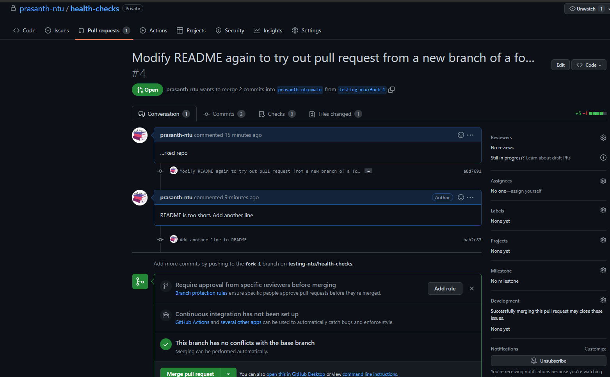
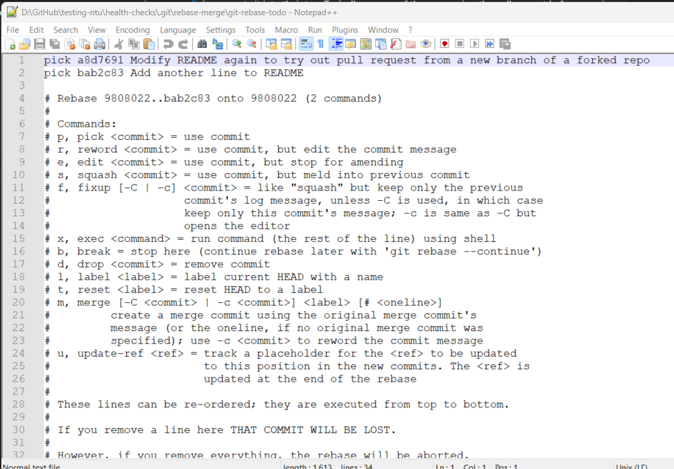
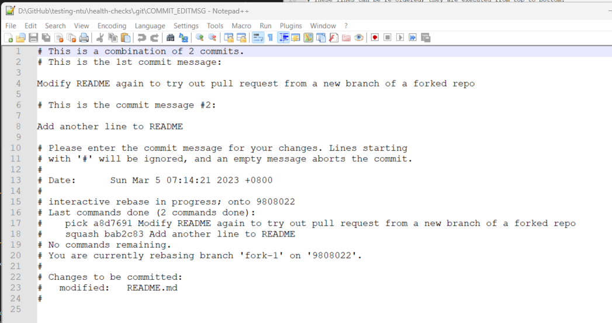
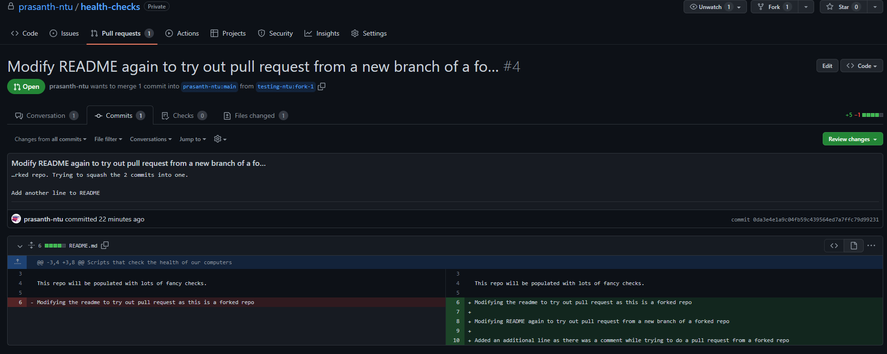

# Notes: Week 4 - Collaboration
- [Notes: Week 4 - Collaboration](#notes-week-4---collaboration)
  - [Pull Requests](#pull-requests)
    - [A Simple Pull Request on GitHub](#a-simple-pull-request-on-github)
    - [The Typical Pull Request Workflow on GitHub](#the-typical-pull-request-workflow-on-github)
    - [Updating an Existing Pull Request](#updating-an-existing-pull-request)
    - [Squashing Changes](#squashing-changes)
    - [Git Fork and Pull Requests Cheat Sheet](#git-fork-and-pull-requests-cheat-sheet)
  - [Code Reviews](#code-reviews)
    - [What are code reviews?](#what-are-code-reviews)
    - [The Code Review Workflow](#the-code-review-workflow)
    - [How to Use Code Reviews in GitHub](#how-to-use-code-reviews-in-github)
    - [More Information on Code Reviews](#more-information-on-code-reviews)
  - [Managing Projects](#managing-projects)
    - [Managing Collaborations](#managing-collaborations)
    - [Tracking Issues](#tracking-issues)
    - [Continuous Integration](#continuous-integration)
    - [Additional Tools](#additional-tools)
  - [To-do's](#to-dos)

## Pull Requests
### A Simple Pull Request on GitHub 
> **Forking**: A way of creating a copy of the given repository so that it belongs to us

In other words, we will be able to push changes to the forked copy, even if we are not able to push changes to other repo. Forked repo is just like a normal repo, except GitHub knows which repo we forked from, so that we can eventually merge our changes back to the main repo, by creating a pull request.

Typical workflow wile collaborating on projects hosted in GitHub
- Fork repo > Work locally > Pull request

> **Pull request**: A commit or series of commits that you send to the owner of the repo so that they incorporate it into their tree
Typically, owners of the repo review the pull request before merging them.

### The Typical Pull Request Workflow on GitHub


### Updating an Existing Pull Request


### Squashing Changes
From `fork-1` branch of forked repo, we made a commit and sent a pull request.
Since, we received a comment from owner of the repo to add another line to README, we added another line and made a commit again. Both the commits are now automatically part of the same pull request.<br>


From the forked repo `fork-1` branch, let's rebase against `main` using the additional argument `-i` to do interactive rebasing.
```ps
$ git rebase -i main
hint: Waiting for your editor to close the file... 
```
This opens up the editor where we can decide how to deal with multiple commits.<br>

By changing the first word of each line, we can select what we want to do with the commit. Let's modify the commits as follows
```
pick a8d7691 Modify README again to try out pull request from a new branch of a forked repo
squash bab2c83 Add another line to README
```
After saving and closing this, a new file opens.
Since we chose `pick` for 1st commit and `squash` for 2nd commit, the 2nd commit is meld (squahsed) into the 1st commit. This opens up another editor to edit these combined commit messages, along with additional details.<br>

Let's modify it as follows, save and close the file
```
Modify README again to try out pull request from a new branch of a forked repo. Trying to squash the 2 commits into one.

Add another line to README
```
Then, we can see that our `rebase` worked. By doing `git show`, we can verify that our changes in the two commits have been combined into one file and the right commit message
```ps
$ git rebase -i main
[detached HEAD 0da3e4e] Modify README again to try out pull request from a new branch of a forked repo. Trying to squash the 2 commits into one.
 Date: Sun Mar 5 07:14:21 2023 +0800
 1 file changed, 5 insertions(+), 1 deletion(-)
Successfully rebased and updated refs/heads/fork-1.

$ git show
commit 0da3e4e1a9c04fb59c439564ed7a7ffc79d99231 (HEAD -> fork-1)
Author: prasanth-ntu <prasanththegalaxian@gmail.com>
Date:   Sun Mar 5 07:14:21 2023 +0800

    Modify README again to try out pull request from a new branch of a forked repo. Trying to squash the 2 commits into one.

    Add another line to README

diff --git a/README.md b/README.md
index 9e87e74..4f6acc7 100644
--- a/README.md
+++ b/README.md
@@ -3,4 +3,8 @@ Scripts that check the health of our computers

 This repo will be populated with lots of fancy checks.

-Modifying the readme to try out pull request as this is a forked repo
\ No newline at end of file
+Modifying the readme to try out pull request as this is a forked repo
+
+Modifying README again to try out pull request from a new branch of a forked repo
+
+Added an additional line as there was a comment while trying to do a pull request from a forked repo
\ No newline at end of file
```

After squashing the two commits into one, git tells us that our local branch `fork-1` has 1 commit, whereas our remote branch `origin/fork-1` has two commits, which we have already pushed to repo before squashing these 2 commits locally. 
```ps
$ git status
On branch fork-1
Your branch and 'origin/fork-1' have diverged,
and have 1 and 2 different commits each, respectively.
  (use "git pull" to merge the remote branch into yours)

nothing to commit, working tree clean
```
Lets look at the recent 4 commits. From the graph, we can see that `origin/fork-1` is in different path than the local branch `fork-1`. This is exepcted whenever we do `rebase`, because our old commits before rebasing are in the remote repo, and we have a different commit in local repo. 
```ps
$ git log --graph --oneline --all -4
* 0da3e4e (HEAD -> fork-1) Modify README again to try out pull request from a new branch of a forked repo. Trying to squash the 2 commits into one.
| * bab2c83 (origin/fork-1) Add another line to README
| * a8d7691 Modify README again to try out pull request from a new branch of a forked repo
|/
*   9808022 (origin/main, origin/HEAD, main) Merge pull request #1 from prasanth-ntu/main
|\
```
Let's see what happens if we try to do `git push`. As expected, `git` does not like us trying too push our change because it cannot be fast-forwarded. However, we do not want to create a `merge`. Instead, we want to replace the old commits with new one. To do this, we can call `git push -f` to force git to push the current snapshot to remote repo as is.
```ps
$ git push
To https://github.com/testing-ntu/health-checks
 ! [rejected]        fork-1 -> fork-1 (non-fast-forward)

$ git push -f
Enumerating objects: 5, done.
Counting objects: 100% (5/5), done.
Delta compression using up to 8 threads
Compressing objects: 100% (3/3), done.
Writing objects: 100% (3/3), 629 bytes | 629.00 KiB/s, done.
Total 3 (delta 0), reused 0 (delta 0), pack-reused 0
To https://github.com/testing-ntu/health-checks
 + bab2c83...0da3e4e fork-1 -> fork-1 (forced update)
```
This time our push completed successfully. Git even tells us that we have forced our update. This time, we just have one commit on top of `main`. The divergence is gone.
 ```ps
 $ git log --graph --oneline --all -2
* 0da3e4e (HEAD -> fork-1, origin/fork-1) Modify README again to try out pull request from a new branch of a forked repo. Trying to squash the 2 commits into one.
*   9808022 (origin/main, origin/HEAD, main) Merge pull request #1 from prasanth-ntu/main
|\
```
Now, let's look at the contents of the pull request. We can see that we managed to combine our commits using interactive version of git rebase.<br>


In a nutshell, we know, how to 
1. Create a pull request
2. Update the pull request
3. Squash changes

### Git Fork and Pull Requests Cheat Sheet
Check out the following link for more information:

- https://help.github.com/en/articles/about-pull-request-merges

## Code Reviews
### What are code reviews?
> Code Review: Going through someone else' code, documentation, or configuration and checking that it all makes sense and follows the expected patterns

### The Code Review Workflow 
Lots of Python project uses `PEP8` style guide.


### How to Use Code Reviews in GitHub


### More Information on Code Reviews
Check out the following links for more information:

- http://google.github.io/styleguide/
- https://help.github.com/en/articles/about-pull-request-reviews
- https://medium.com/osedea/the-perfect-code-review-process-845e6ba5c31
- https://smartbear.com/learn/code-review/what-is-code-review/

## Managing Projects
### Managing Collaborations
- If you are a project maintainer, it's important that you reply promptly to pull requests and don't let them stagnate
- It's important we understand all the changes we accept

### Tracking Issues
- When it comes to coordinating who does what and when, a comon strategy for active software projects is to use an **issue tracker**
- We can also automatically close the issues with a commit in the the pull request by including things like `Closes #1` in the commit title or description implying that this commit will close the issue #1 

### Continuous Integration
> CI: Will build and test our code every time there's a change

> CD: Once we have our code automatically built and tested, the next automation step is continuous deployment, which is sometimes called **continous delivery (CD)**.
 
CI/CD options: 
- Jenkins 
- GitLab provides their own CI/CD solution
- GitHub does not provide its own CI/CD solution. Instead, we can use alternatives like Travis 

> Pipelines: Specify the steps that need to run to get the result we want

> Artifacts: Name used to describe any files that are generated as part of the pipeline 

Two things to remember
1. Make sure the authorized entities for the test servers are not the same entities authorized to deploy on the production servers
   1. That way, if there's any compromise in the pipeline, our production server is not affected. 
2. Always have a plan to recover our access in case our pipeline gets compromised.

### Additional Tools
Check out the following links for more information:

- https://arp242.net/diy.html 
- https://help.github.com/en/articles/closing-issues-using-keywords
- https://help.github.com/en/articles/setting-guidelines-for-repository-contributors 
- https://www.infoworld.com/article/3271126/what-is-cicd-continuous-integration-and-continuous-delivery-explained.html
- https://stackify.com/what-is-cicd-whats-important-and-how-to-get-it-right/
- https://docs.travis-ci.com/user/tutorial/
- https://docs.travis-ci.com/user/build-stages/

## To-do's
- [ ] Run through [git fork and pull requests cheat sheet](#git-fork-and-pull-requests-cheat-sheet)
- [ ] Run through [More Information on Code Reviews](#more-information-on-code-reviews)
- [ ] Run through [Additional Tools](#additional-tools)